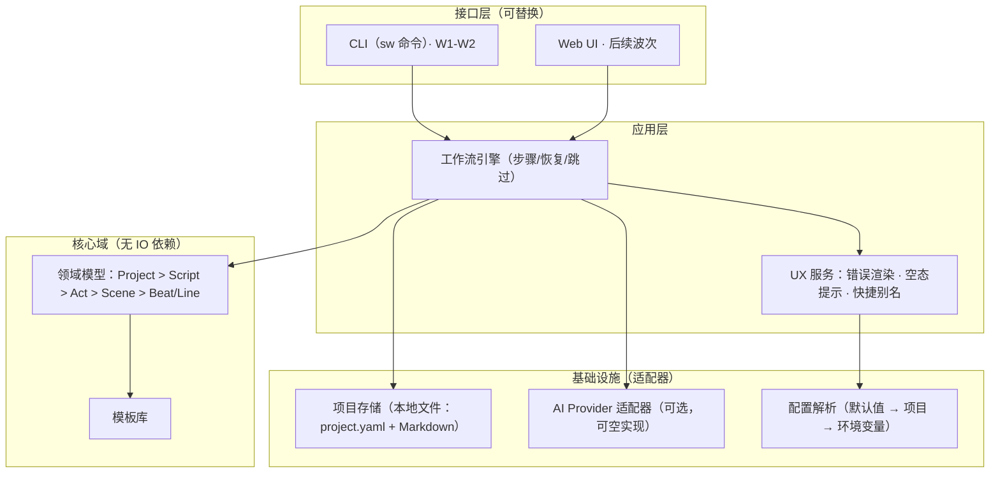
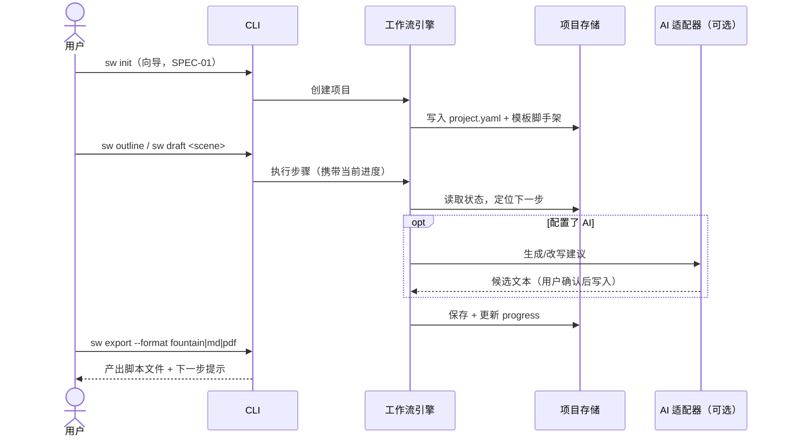

# W1-P1 功能易用性：架构级深度检查与迭代方案

| 项目 | 内容 |
| --- | --- |
| 波次 / 槽位 | 第 1 波（wave-01）/ 周期 W1 架构与方案 / 计划槽 P1 功能易用性 |
| 仓库 | github.com/Dawan2/script-writer |
| 检查基线 | `main @ deda75a`（Initial commit） |
| 工作分支 | `cursor/w1-p1-usability-architecture-5d0e` |
| 文档性质 | 架构检查报告 + 绿地易用性架构方案 + 高影响功能规格 |
| 配套文档 | `docs/wave-01/ready-tasks.md`（就绪任务队列）、`docs/DISPATCH-receipt.md`（槽位回执） |

---

## 1. 检查结论（TL;DR）

仓库当前处于**初始提交状态**：全库仅一个文件 `README.md`，内容为一行标题 `# script-writer`；无源码、无 docs、无 CI、无 issue 模板、无其他分支。因此：

1. 传统意义上的"对既有架构做易用性检查"没有对象——七个易用性维度（信息架构、工作流步骤、空态/错态、快捷操作、心智负担、文档可发现性、配置成本）当前得分均为**缺失（N/A → 0）**，详见第 2 节盘点表。
2. 这恰是**成本最低的干预时机**：易用性约束在代码写下之前注入，比事后返工便宜一个数量级。本文将检查报告转化为一份**易用性优先（usability-first）的绿地架构方案**，为后续工作槽的功能开发划定不可回退的易用性基线。
3. 本槽产出：本方案文档、按优先级排序的就绪任务队列（10 项，`ready-tasks.md`）、3 份可直接实现的功能规格（第 7 节 SPEC-01/02/03）。**本槽不做功能开发**，符合 W1 定位。

---

## 2. 仓库现状盘点（七维度检查表）

检查方法：通读全库文件树与 git 历史（`git log --all`、远端分支列表），逐维度评估。

| # | 维度 | 现状 | 证据 | 风险等级 |
| --- | --- | --- | --- | --- |
| 1 | 信息架构 | 缺失。无目录结构、无领域模型、无命名约定 | 全库仅 `README.md` 1 行 | 高：首批代码会事实性地定义 IA，若无约束将随机生长 |
| 2 | 工作流步骤 | 缺失。产品主工作流未定义 | 无任何代码或设计文档 | 高：工作流是易用性的骨架，必须先于功能定型 |
| 3 | 空态 / 错态 | 缺失。无错误处理约定、无空态设计 | 同上 | 中：可后补，但错误码体系宜从第一行代码就启用 |
| 4 | 快捷操作 | 缺失 | 同上 | 低：属渐进增强，依赖主工作流先落地 |
| 5 | 心智负担 | 不可评估；但"零文档 README"本身已构成负担——访客无法知道这是什么、怎么用 | `README.md` 无产品说明 | 高（对协作者/访客即时生效） |
| 6 | 文档可发现性 | 缺失。无 docs/、README 无链接 | 同上 | 高（同上，且是本波次交付物的载体） |
| 7 | 配置成本 | 缺失。无配置面，也无"零配置"承诺 | 同上 | 中：默认值策略应在脚手架期确定 |

**结论**：不存在"已存在且有效的 docs 或提交"可复用（除 Initial commit 本身），本槽产出均为新增，无重做风险。

---

## 3. 产品假设与待确认决策

仓库名 `script-writer` 与里程碑语境指向"**脚本写作工具**"。在调度器未给出产品简报的情况下，本方案基于以下显式假设展开，**所有假设均需在 W1 内由 ADR 确认**（见 ready-tasks `W1-P1-T02`）：

| 编号 | 假设 | 依据 | 若假设错误的影响 |
| --- | --- | --- | --- |
| A1 | 产品是"辅助创作影视/短视频/播客脚本"的工具：支持大纲→场景→台词的结构化写作与导出 | 仓库名；"script"在创作语境的通用含义 | 第 6、7 节的领域模型需替换，但七维度设计准则（第 5 节）不受影响 |
| A2 | 可选接入 LLM 做生成/改写辅助，但核心工作流不强依赖任何 AI 供应商 | 降低配置成本与供应商锁定（维度 7） | 若强依赖 AI，则 SPEC-03 需增加供应商错误映射层 |
| A3 | 首个交付形态为 **CLI + 本地文件项目**（`sw` 命令），Web UI 作为第二形态复用同一核心库 | CLI 起步实现成本最低、可脚本化、便于代理协作开发与 CI 验证 | 若直接做 Web，SPEC-01/02 的接口层需换壳，数据流与状态文件设计不变 |
| A4 | 技术栈倾向 TypeScript/Node（单语言同时覆盖 CLI 与未来 Web），Python 为备选 | 生态与 CLI/Web 复用性 | 仅影响任务的文件范围字段，不影响架构分层 |

> **决策请求（阻塞项 B1）**：请调度器在下一槽前确认 A1–A4，或提供产品简报。未确认时，后续实现槽应按本文假设执行，以免整波停摆。

---

## 4. 易用性目标与度量（North-star）

易用性必须可测，否则会在功能压力下被牺牲。定义以下指标并写入 CI/评审门槛：

| 指标 | 定义 | 目标值 | 测量方式 |
| --- | --- | --- | --- |
| TTFS（Time To First Script） | 从 `git clone`/安装 到导出第一份可用脚本的操作步数与耗时 | ≤ 5 条命令、≤ 3 分钟（不含模型延迟） | 新手路径脚本化回放（`W1-P1-T10`） |
| 必填配置项数 | 完成主工作流必须由用户手工提供的配置项数量 | 0（AI 功能除外，其为 1：API key） | 配置面清单评审 |
| 错误自解释率 | 用户可见错误中，包含"发生了什么/为什么/怎么办"三段式且带文档锚点的比例 | 100%（经由 SPEC-03 框架强制） | 错误码注册表 lint |
| 空态覆盖率 | 每个"列表/画布可能为空"的界面位点具有引导式空态的比例 | 100% | 界面位点清单评审 |
| 文档三跳可达 | 任意功能文档从 README 出发 ≤ 3 次链接可达 | 100% | docs IA lint（链接检查） |
| 命令可发现性 | 每条 CLI 子命令 `--help` 输出含 ≥1 个可复制示例 | 100% | help 快照测试 |

---

## 5. 目标架构总览（易用性优先的分层）

### 5.1 分层与依赖方向



关键约束（均直接服务于易用性维度）：

- **核心域零 IO**：领域模型不感知文件系统与网络，保证 CLI/Web 双形态共享同一行为，用户在两形态间迁移零心智成本（维度 5）。
- **AI 为可空适配器**：未配置 API key 时全部工作流可走"手写模式"完整跑通，避免"必须先配 key 才能试用"的高配置门槛（维度 7）。
- **存储为纯文本文件**（YAML 元数据 + Markdown 正文）：用户可用任意编辑器直接改、可 git 版本化、可被后续 Web UI 无损读取——项目文件即接口（维度 1、5）。
- **UX 服务是强制通道**：所有面向用户的错误与空态输出必须经由统一渲染层（SPEC-03），禁止散落的 `console.error`/裸异常（维度 3）。

### 5.2 主数据流（一次典型写作会话）



---

## 6. 七维度设计准则与落地方案

### 6.1 信息架构（IA）

- **领域层级**：`Project（项目）> Script（剧本）> Act（幕）> Scene（场）> Beat/Line（节拍/台词）`。CLI 命令、文件目录、文档章节三者使用**同一套词汇**，杜绝"命令叫 chapter、文件叫 section、文档叫 episode"式的词汇漂移。
- **项目目录布局**（用户可见即文档）：

```text
my-story/
├── project.yaml        # 项目元数据 + 工作流进度（单一状态源，SPEC-02）
├── outline.md          # 大纲
├── characters/         # 角色卡（每角色一个 .md）
├── scenes/             # 每场一个 .md，文件名 = 场编号 + slug
│   └── 010-opening.md
└── exports/            # 导出产物（git-ignored）
```

- **仓库侧 IA**：`src/core`（领域）、`src/app`（工作流 + UX 服务）、`src/cli`、`src/infra`、`templates/`、`docs/`。评审规则：新增顶层目录必须有 ADR。

### 6.2 工作流步骤

- **五步主工作流**：`init → outline → draft → revise → export`。每步：
  - **可恢复**：进度持久化在 `project.yaml`，任意时刻 `sw status` 显示"你在第几步、下一步是什么、命令是什么"（可粘贴执行）。
  - **可跳过**：高级用户可直接 `sw draft`，引擎自动补默认大纲骨架并提示（渐进披露而非强制线性）。
  - **幂等**：重复执行同一步不破坏既有内容（只补缺、不覆盖，覆盖需 `--force`）。
- **反模式禁令**：禁止"必须一次性回答 10 个问题的巨型向导"；向导单次 ≤ 4 问，其余用默认值 + 事后可改（见 SPEC-01）。

### 6.3 空态 / 错态

- **空态三要素**：每个空列表/空文件位点必须回答——这里是什么、放一个示例长什么样、下一步敲什么命令。例如 `scenes/` 为空时，`sw status` 输出内嵌一条可复制的 `sw draft 010 --title "开场"`。
- **错态**：统一错误码体系 `SW-Exxx` + 三段式消息（发生了什么 / 为什么 / 怎么办）+ 文档锚点链接。详见 SPEC-03。CI 用注册表 lint 强制 100% 覆盖。

### 6.4 快捷操作

- 单一入口命令 `sw`（`script-writer` 的别名同时注册）。
- `sw`（无参数）= `sw status`：最常用信息零记忆成本可达。
- 高频动作提供短别名：`sw d` = `sw draft`、`sw x` = `sw export`；别名表集中声明，`--help` 中可见。
- 未来 Web 形态提供命令面板（Ctrl/Cmd+K），命令 ID 与 CLI 子命令一一对应（同一词汇表）。

### 6.5 心智负担

- **约定优于配置**：目录布局、文件命名、导出格式均有默认值；用户只需要记住"一个命令 `sw` + 跟着 status 提示走"。
- **单一状态源**：进度、配置、元数据都在 `project.yaml`，不引入隐藏的 dotfile 状态；用户可读、可 diff、可回滚。
- **渐进披露**：`--help` 默认只展示五步主命令；`sw help --all` 才展示全部子命令与旗标。

### 6.6 文档可发现性

- **README = 路由页**：30 秒电梯陈述 + 一段可复制的 Quickstart + 指向 docs/ 各区的链接（三跳可达原则，见第 4 节指标）。
- **docs/ IA**：`docs/quickstart.md`、`docs/concepts/`（领域词汇表）、`docs/reference/`（命令逐条）、`docs/errors/`（错误码逐条，SPEC-03 的锚点目标）、`docs/wave-*/`（波次工作文档，与用户文档隔离）。
- **互链闭环**：`--help` 尾部印文档 URL；错误消息尾部印错误码文档锚点；文档页首印对应命令。

### 6.7 配置成本

- **零配置可跑通**：`sw init && sw draft && sw export` 在无任何配置文件、无网络时可产出脚本（手写模式）。
- **配置分层**（后者覆盖前者）：内置默认值 → `project.yaml` 的 `settings:` 段 → 环境变量（仅密钥类，如 `SW_OPENAI_API_KEY`）。禁止第四层。
- **`sw doctor`**：一条命令自检环境（Node 版本、项目文件完整性、AI key 有效性），每项给出绿/红 + 修复命令。

---

## 7. 高影响功能规格（供后续工作槽实现）

以下规格达到"可直接开工"粒度。实现顺序即编号顺序（03 的错误框架可与 01 并行，但 01/02 的错误输出必须在合并前迁移到 03 框架上）。

---

### SPEC-01 `sw init` 交互式初始化向导

**目标**：将 TTFS 的"第一分钟"压缩为一次 ≤ 4 问的向导，产出可立即续写的项目脚手架。

**CLI 接口**：

```text
sw init [dir] [--template <id>] [--yes] [--title <t>] [--format <screenplay|short-video|podcast>]
```

- 交互模式（默认）：依次询问 ①项目标题 ②脚本类型（模板三选一）③预计场数（默认 5）④是否启用 AI 辅助（默认否）。每问显示默认值，回车即接受。
- `--yes`：全部采用默认值，非交互（CI/脚本友好）。所有问题都有对应旗标，旗标提供的问题自动跳过。
- 目标目录非空且无 `--force` 时报 `SW-E010`（见 SPEC-03），并提示 `sw init --force` 与其后果。

**数据流**：CLI 收集答案 → 工作流引擎调用模板库渲染（模板 = `templates/<id>/` 下的文件树 + 变量占位）→ 项目存储原子写入（临时目录写完后 rename，避免半成品项目）→ 输出成功摘要 + 下一步命令（`sw status`）。

**产出的 `project.yaml` schema（v1）**：

```yaml
schema: 1                 # 状态文件版本，供未来迁移
title: "我的短片"
format: short-video        # screenplay | short-video | podcast
created: 2026-08-27
settings:
  ai: { enabled: false, provider: null }
  export: { default: fountain }
progress:
  step: outline            # init|outline|draft|revise|export
  scenes_done: []
```

**验收要点**：全流程 ≤ 4 问；`--yes` 模式零交互跑通；生成目录结构与 6.1 布局一致；重复 init 幂等（报错不破坏现场）。

---

### SPEC-02 项目状态文件与恢复式工作流引擎（最小版）

**目标**：让"随时中断、随时 `sw status` 找回上下文"成为产品性格，消除"我做到哪了"的心智负担。

**接口**：

- `sw status`：输出项目标题、当前步骤、场景完成度（`3/5 场已完成`）、**下一步建议命令**（可直接复制执行）。无参数 `sw` 等价于此命令。
- `sw outline`：打开/创建 `outline.md`；若为空写入模板骨架（空态三要素内嵌为 Markdown 注释）。
- `sw draft <scene-id> [--title <t>]`：创建/续写 `scenes/<id>-<slug>.md`；完成后把 id 记入 `progress.scenes_done`。
- `sw export [--format <f>] [--out <path>]`：聚合 outline + scenes 渲染为目标格式，写入 `exports/`。

**引擎数据流**：每条命令启动时 ①读取并校验 `project.yaml`（schema 版本不符 → `SW-E020` 并给迁移指引）②计算当前步骤与缺口 ③执行动作 ④原子回写状态 ⑤经 UX 服务输出结果 + 下一步提示。状态回写与文件产出在同一事务语义内（先写临时文件再 rename）。

**验收要点**：kill -9 中断后重跑 `sw status` 状态一致；五步命令的输出末行均为可复制的下一步命令；`scenes_done` 与磁盘实际文件用 `sw doctor` 可校验一致性。

---

### SPEC-03 统一错误与空态框架

**目标**：错误自解释率 100%（第 4 节指标），把"报错"变成"引导"。

**错误码注册表**（`src/app/errors/registry.ts` + 生成的 `docs/errors/`）：

| 段 | 含义 | 示例 |
| --- | --- | --- |
| SW-E0xx | 项目/文件系统 | E010 目标目录非空；E011 缺少 project.yaml（附 `sw init` 提示） |
| SW-E02x | 状态/版本 | E020 schema 版本不兼容 |
| SW-E03x | 输入校验 | E030 场景 id 不存在（附现有 id 列表） |
| SW-E04x | AI 供应商 | E040 缺 key；E041 供应商 4xx/5xx（附降级为手写模式的提示） |

**消息模板**（渲染层强制）：

```text
✖ SW-E011 当前目录不是 script-writer 项目
  原因：未找到 project.yaml。
  怎么办：运行 `sw init` 新建项目，或 cd 到既有项目目录。
  详情：https://…/docs/errors/SW-E011
```

**接口**：`fail(code, ctx)` 为抛错唯一入口；接口层顶层 catch 统一渲染；未注册码在 CI lint 中失败。空态复用同一渲染层的 `hint(slot, ctx)`，空态文案与错误文案同库管理、同 lint 覆盖。

**数据流**：注册表（单一数据源）→ 构建时生成 `docs/errors/*.md`（保证消息与文档永不漂移）→ 运行时渲染层查表输出。

**验收要点**：注册表 lint 进 CI；`docs/errors/` 由注册表生成且提交；抽查任意错误输出符合三段式 + 锚点。

---

## 8. 迭代方案（按工作槽排布，非日历时间）

| 槽序 | 主题 | 内容 | 对应任务 |
| --- | --- | --- | --- |
| W1-P1（本槽） | 方案与任务核验 | 本文档 + 就绪任务队列 + 回执 | — |
| 下一实现槽 α | 地基 | ADR-0001 定栈、脚手架 + CI、README 路由页 | T01–T03 |
| 实现槽 β | 主工作流 | SPEC-01 init 向导、SPEC-03 错误框架（可并行） | T04、T06 |
| 实现槽 γ | 闭环 | SPEC-02 状态/引擎最小版 → TTFS 首次可测 | T05、T10 |
| 实现槽 δ | 增强 | 模板库 v1、`sw doctor`、docs IA 落地 | T07–T09 |

回退策略：若槽 β/γ 超载，优先砍模板数量与导出格式数量，**不砍**错误框架与 status 可恢复性——后两者是易用性基线，不可交易。

## 9. 风险与阻塞

| 编号 | 类型 | 描述 | 缓解 |
| --- | --- | --- | --- |
| B1 | 阻塞（待调度器） | 产品假设 A1–A4 未经确认 | 已在第 3 节声明默认执行策略：未答复则按本文假设推进 |
| R1 | 风险 | 首批实现者绕过 UX 服务直接打印错误，框架名存实亡 | 注册表 lint 进 CI（T06 验收标准）+ 评审清单 |
| R2 | 风险 | 后续槽在 `ready-tasks.md` 上产生并发追加冲突 | 该文件约定"按槽位标题分区、只追加不改写他区"（文件头已注明） |
| R3 | 风险 | AI 功能引入后配置成本失控 | 维持"AI 可空适配器"硬约束；新增配置项须过第 4 节"必填配置项数"门槛 |
