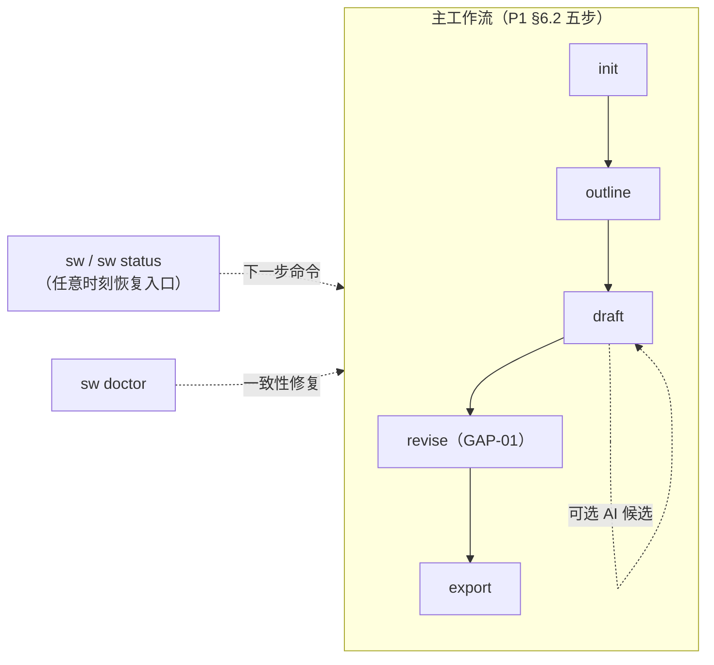

# W1-B 功能与交互路径盘点（第1波 / 周期W1 / 工作槽W1-B）

| 项目 | 内容 |
| --- | --- |
| 波次 / 槽位 | 第 1 波（wave-01）/ 周期 W1 / 工作槽 W1-B 功能与交互路径盘点 |
| 仓库 | github.com/Dawan2/script-writer |
| 盘点基线 | `main @ deda75a`（Initial commit，空仓） |
| 盘点日期 | 2026-08-27（UTC） |
| 工作分支 | `cursor/w1-b-features-flows-9843` |
| 文档性质 | 目标功能与交互路径盘点（引用 P1 SPEC / P2 裁决，不重复架构正文，不新增架构决策） |
| 配套文档 | `docs/DISPATCH-receipt.md`（槽位回执，追加式） |

---

## 1. 结论速览（TL;DR）

1. **`main` 为空仓**（仅 1 行 README，逐项证据见 W1-A `inventory-codebase.md` §3，本文不复述）。因此本文盘点的不是"现有功能"，而是**目标功能与目标交互路径**——以已落地的规划文档为唯一依据。
2. **对齐口径**：产品形态按 P1 假设 A1–A4（CLI 优先、`sw` 命令、本地文件项目）默认执行；P2 以 Web 形态表述的裁决，按其自身声明（P2 §0"冲突以先落地者为准"）与 W1-A §5 的映射原则，逐条映射到 CLI 阶段或显式延后（见第 6 节映射表）。
3. **盘点结果**：用户可见功能 13 项（F-01…F-13，第 3 节）、主路径 6 条（MP-01…06）、边缘路径 12 条（EP-01…12）、空态位点 6 个（ES-01…06，可直接用作 P1 §4"空态覆盖率"指标的评审基准清单）、错态 6 码（ER 表，对应 SPEC-03 注册表 v1 全集）、差距登记 6 项（GAP-01…06，第 7 节）。
4. 全部功能状态为**规划中**（空仓事实的直接推论）；每条路径均标注设计依据（文档 § / 条款号）与验收锚（ready-tasks 任务号），供实现槽直接消费、供 W5 核验槽回查。

---

## 2. 盘点方法与对齐依据

- **输入**（只引用，不改写、不重做）：
  - P1 `docs/wave-01/P1-usability-architecture.md` @ `5545c22`（假设 A1–A4、七维度准则 §6、SPEC-01/02/03 §7、度量 §4）
  - P2 `docs/wave-01/P2-interaction-reliability.md` @ `7873b66`（裁决 D1–D39，重点消费向导/会话相关 D5–D9、D20–D25）
  - W1-A `docs/wave-01/inventory-codebase.md` @ `92e19a4`（空仓证据、P2→CLI 映射原则、目标目录树）
  - W1-D `docs/wave-01/maturity-baseline.md` @ `60c37e8`（证据规则；本文性质为规划盘点，不产生 E1–E5 运行证据）
  - P1 分支 `docs/wave-01/ready-tasks.md`（W1-P1-T01…T10，用作验收锚）
- **冲突处理**：P1（CLI 优先）先于 P2（Web 假设）落地，P2 §0 已自我声明"以先落地者为准"；本文据此把 P2 向导/会话裁决区分为"CLI 阶段已映射 / 部分映射 / 延后至 Web 形态回接"三档（第 6 节），**不裁决新冲突**。
- **记号约定**：F=功能、MP=主路径、EP=边缘路径、ES=空态位点、ER=错态、GAP=差距。编号一经引用不复用不改义（沿用 ready-tasks 的 ID 纪律）。

---

## 3. 用户可见功能清单（目标态，全部规划中）

| ID | 功能 | 用户可见形态 | 依据 | 落地任务 |
| --- | --- | --- | --- | --- |
| F-01 | 项目初始化向导 | `sw init [dir] [--template] [--yes] [--title] [--format] [--force]`，交互 ≤ 4 问，每问带默认值回车即接受 | SPEC-01 | W1-P1-T04 |
| F-02 | 状态与下一步导航 | `sw status`；无参数 `sw` 等价；输出含可复制的下一步命令 | SPEC-02、P1 §6.4 | W1-P1-T05 |
| F-03 | 大纲编辑入口 | `sw outline`：打开/创建 `outline.md`，空文件写入模板骨架 | SPEC-02 | W1-P1-T05 |
| F-04 | 场景写作 | `sw draft <scene-id> [--title]`：创建/续写 `scenes/<id>-<slug>.md`，完成记入 `progress.scenes_done` | SPEC-02 | W1-P1-T05 |
| F-05 | 脚本导出 | `sw export [--format fountain\|md\|pdf] [--out]`，写入 `exports/`（默认格式取 `settings.export.default`） | SPEC-02、P1 §5.2 | W1-P1-T05（首版仅 md，回退策略 P1 §8） |
| F-06 | 修订步骤（revise） | 五步主工作流成员（`init → outline → draft → revise → export`），**无命令规格** | P1 §6.2 | 无（→ GAP-01） |
| F-07 | 环境与项目自检 | `sw doctor`：逐项绿/红 + 修复命令；退出码全绿 0 否则 1 | P1 §6.7 | W1-P1-T08 |
| F-08 | 帮助系统 | 每条子命令 `--help` 含 ≥ 1 可复制示例、尾部印文档 URL；默认只展示五步主命令，`sw help --all` 展示全集 | P1 §4、§6.5、§6.6 | W1-P1-T10（快照）；全集清单未定义 → GAP-02 |
| F-09 | AI 辅助（可选） | init 第 ④ 问启用（默认否）；`draft` 时生成/改写候选文本，**用户确认后才写入**；未配置时全工作流手写模式可跑通 | P1 §5.2、A2、§6.7 | W1-P1-T04/T05（AI 适配器后续挂接） |
| F-10 | 模板库三选一 | `--format screenplay\|short-video\|podcast`（对应 `--template`） | SPEC-01 | W1-P1-T04（short-video）→ T07（其余两个） |
| F-11 | 项目文件即接口 | `project.yaml` + Markdown 纯文本，用户可用任意编辑器直接改、可 git 版本化 | P1 §5.1 存储约束 | 无独立任务（属存储层性质；一致性校验归 F-07） |
| F-12 | 高频短别名 | `sw d` = `sw draft`、`sw x` = `sw export`；别名表集中声明并在 `--help` 可见 | P1 §6.4 | 未落入任何任务文件范围 → GAP-02 |
| F-13 | 文档面 | README 路由页、`docs/quickstart.md`、`docs/reference/`（命令逐条）、`docs/errors/`（错误码锚点，注册表生成） | P1 §6.6 | W1-P1-T01/T06/T09 |

---

## 4. 交互路径盘点

### 4.1 路径总览

### 4.2 主路径（MP，happy path）

每条给出：步骤序列 → 期望产出 → 验收锚。

| ID | 路径 | 步骤序列与期望产出 | 依据 | 验收锚 |
| --- | --- | --- | --- | --- |
| MP-01 | 新手首跑（TTFS 路径） | 安装 → `sw init`（≤ 4 问）→ `sw outline` → `sw draft 010` → `sw export`；每步末行输出下一步可复制命令；最终 `exports/` 产出脚本文件。**度量：≤ 5 条命令、≤ 3 分钟** | SPEC-01/02、P1 §4 TTFS | W1-P1-T05（e2e 全链路）、T10（ttfs-bench 断言） |
| MP-02 | 中断后恢复 | 任意时刻 `sw`（= `sw status`）→ 输出项目标题、当前步骤、场景完成度（如 `3/5 场已完成`）、下一步建议命令 → 粘贴执行即续写 | SPEC-02 | W1-P1-T05（kill -9 后状态一致验收） |
| MP-03 | 非交互 / CI 路径 | `sw init --yes [--title …]` → 零交互全默认建项 → 后续同 MP-01；旗标已提供的问题自动跳过 | SPEC-01 | W1-P1-T04（`--yes` 零交互验收） |
| MP-04 | AI 辅助写作（opt-in） | init 第 ④ 问启用（或事后改 `project.yaml` 的 `settings.ai`，密钥走环境变量层）→ `sw draft` 产生候选文本 → **用户确认后写入** → 保存并更新进度 | P1 §5.2 时序 opt 块、§6.7 配置分层 | AI 适配器挂接槽（后续波次）；确认写入语义随 T05 引擎 |
| MP-05 | 跳步直达（高级用户） | 未做 outline 直接 `sw draft` → 引擎自动补默认大纲骨架并提示 → 继续写作（渐进披露，非强制线性） | P1 §6.2 可跳过 | W1-P1-T05 |
| MP-06 | 导出与格式切换 | `sw export --format fountain\|md\|pdf --out <path>`；缺省格式取 `settings.export.default`（v1 schema 默认 fountain） | SPEC-01 schema、SPEC-02、P1 §5.2 | W1-P1-T05（首版 md；格式扩展按 P1 §8 回退策略排布） |

### 4.3 边缘路径（EP）

每条给出：触发 → 预期行为 → 依据 → 验收锚。

| ID | 触发 | 预期行为 | 依据 | 验收锚 |
| --- | --- | --- | --- | --- |
| EP-01 | `sw init` 目标目录非空且无 `--force` | 报 `SW-E010`，提示 `sw init --force` 及其后果；**不破坏现场** | SPEC-01 | W1-P1-T04（重复 init 幂等验收） |
| EP-02 | 向导进行中被中断（Ctrl-C / 断电） | 原子写（临时目录写完 rename）保证**无半成品项目**；重跑 init 从头开始，代价 ≤ 4 问。CLI 阶段有意不做会话续跑（对照 P2 D20，见第 6 节） | SPEC-01 数据流 | W1-P1-T04 |
| EP-03 | 命令写入中途 `kill -9` | 状态回写与文件产出同事务语义（temp + rename）→ 重跑 `sw status` 状态一致，已有内容不丢 | SPEC-02、P2 D9 映射 | W1-P1-T05（kill -9 验收项） |
| EP-04 | 重复执行同一步（重复 init / 重复 draft 同一场） | 幂等：只补缺、不覆盖；覆盖需显式 `--force`。scene-id 即客户端生成 ID，天然幂等 upsert（P2 D5–D7 的 CLI 映射） | P1 §6.2、P2 D7 | W1-P1-T04/T05 |
| EP-05 | 不在项目目录运行项目命令（缺 `project.yaml`） | 报 `SW-E011`，附 `sw init` 新建或 cd 到既有项目的指引 | SPEC-03 | W1-P1-T06 |
| EP-06 | `project.yaml` schema 版本不符 | 报 `SW-E020`，给出迁移指引；不静默升级、不破坏文件 | SPEC-02 | W1-P1-T05/T06 |
| EP-07 | `sw draft <id>` 的场景 id 不存在 | 报 `SW-E030`，**附现有 id 列表**（错误即引导） | SPEC-03 | W1-P1-T06 |
| EP-08 | 启用 AI 但缺 key / 供应商 4xx/5xx | 分别报 `SW-E040` / `SW-E041`，"怎么办"段承载**降级为手写模式**的提示与（可重试时的）重试指引（P2 D8 的 retryable 语义由三段式文案承接） | SPEC-03、P2 D8 映射 | W1-P1-T06 |
| EP-09 | AI 候选文本被用户拒绝 | 不写入任何文件、进度不变（确认后写入是唯一写路径） | P1 §5.2 opt 块 | 随 AI 挂接槽验收 |
| EP-10 | 用户用外部编辑器直接改文件后状态漂移（`scenes_done` 与磁盘不符） | `sw doctor` 红项报告不一致 + 给出修复命令；直接编辑本身是受支持行为（F-11），漂移可检可修 | P1 §6.7、SPEC-02 验收 | W1-P1-T08（三类损坏验收） |
| EP-11 | 同一项目并发两个 `sw` 进程写入 | 已裁决部分：原子写保证无半成品、doctor 可事后校验。**未裁决部分：无文件锁/最后写者胜的显式约定**（P2 D32–D34 属 Web 形态回接）→ GAP-04 | SPEC-01/02 原子写 | 待 GAP-04 归属后补 |
| EP-12 | `--yes` 与部分旗标混用（如 `sw init --yes --title X`） | 旗标覆盖对应问题、其余取默认，仍零交互；所有问题均有对应旗标 | SPEC-01 | W1-P1-T04 |

### 4.4 空态位点清单（ES）

> 本表即 P1 §4"空态覆盖率 100%"指标的**评审基准清单**：实现槽新增空态位点时在此追加，核验槽按此逐项打钩。每个位点须满足空态三要素（这里是什么 / 示例长什么样 / 下一步敲什么命令，P1 §6.3）。

| ID | 位点 | 三要素落点（目标行为） | 依据 | 责任任务 |
| --- | --- | --- | --- | --- |
| ES-01 | `scenes/` 为空 | `sw status` 内嵌一条可复制命令，如 `sw draft 010 --title "开场"` | P1 §6.3 例示 | W1-P1-T05/T07 |
| ES-02 | `outline.md` 为空 | `sw outline` 写入模板骨架，三要素内嵌为 Markdown 注释 | SPEC-02 | W1-P1-T05 |
| ES-03 | `characters/` 为空 | **未定义**——目录在 IA 中存在（P1 §6.1）但无任何命令创建角色卡，空态引导亦未规划 → GAP-05 | P1 §6.1 | 待 GAP-05 归属 |
| ES-04 | `exports/` 为空（尚未导出过） | 未显式定义；建议由 `sw status` 在 export 步提示导出命令承接（属 MP-02 的自然延伸，无需独立空态） | SPEC-02 | W1-P1-T05（评审时确认） |
| ES-05 | 无项目上下文（严格说是错态 `SW-E011`） | 错误消息按三段式引导 `sw init`——空态引导与错态提示在此位点合一，文案同库管理 | SPEC-03（`hint()` 与 `fail()` 同渲染层） | W1-P1-T06 |
| ES-06 | 仓库级空态（访客见单行 README） | README 路由页：电梯陈述 + Quickstart + docs 链接（未实现功能标"规划中"） | P1 §6.6 | W1-P1-T01 |

### 4.5 错态清单（ER）

注册表 v1 全集（SPEC-03 明确"只收 SPEC-01/02 实际触达的错误码，禁止预填未用码"）。所有错误经 `fail(code, ctx)` 唯一入口输出三段式（发生了什么 / 为什么 / 怎么办）+ `docs/errors/` 锚点；错误自解释率目标 100%（P1 §4），注册表 lint 进 CI。

| 码 | 触发路径 | "怎么办"段要点 | 责任任务 |
| --- | --- | --- | --- |
| SW-E010 | EP-01（init 目录非空） | 提示 `--force` 及其后果 | T04/T06 |
| SW-E011 | EP-05 / ES-05（缺 project.yaml） | 指引 `sw init` 或 cd 到项目目录 | T06 |
| SW-E020 | EP-06（schema 版本不符） | 迁移指引 | T05/T06 |
| SW-E030 | EP-07（场景 id 不存在） | 附现有 id 列表 | T06 |
| SW-E040 | EP-08（AI 缺 key） | 配置指引 + 手写模式降级 | T06 |
| SW-E041 | EP-08（AI 供应商 4xx/5xx） | 降级为手写模式；可重试场景附重试指引 | T06 |

退出码约定现状：仅 `sw doctor` 有定义（全绿 0 否则 1，T08 验收）；**其余命令的错误退出码未约定** → GAP-06。

---

## 5. 与度量指标的对应（回查 P1 §4）

| P1 §4 指标 | 本盘点承接物 |
| --- | --- |
| TTFS ≤ 5 命令 ≤ 3 分钟 | MP-01（T10 ttfs-bench 断言路径即 MP-01 步骤序列） |
| 必填配置项数 = 0（AI 除外） | MP-01/MP-03 全程零配置；MP-04 仅 1 项（API key，环境变量层） |
| 错误自解释率 100% | §4.5 ER 表（6 码全集 + 三段式 + 锚点） |
| 空态覆盖率 100% | §4.4 ES 表（位点清单评审的基准清单） |
| 命令可发现性（--help 含示例） | F-08（T10 help 快照断言） |
| 文档三跳可达 | F-13（T09 链接检查） |

---

## 6. P2 向导/会话裁决的 CLI 阶段映射

> 只列与"向导 / 会话 / 用户可见交互路径"直接相关的裁决；P2 其余裁决（请求层 D1–D4、D11–D19 等）的落点已由 W1-A §5 说明（由 `src/infra/store/` 与 `src/app/errors/` 承接原子写/幂等/错误信封约束），不在本文重复。

| P2 裁决 | Web 形态含义 | CLI 阶段（W1 默认形态）对应 | 处置 |
| --- | --- | --- | --- |
| D5–D7（幂等键 / 客户端 ID upsert） | 变更请求带 Idempotency-Key，服务端去重 | 命令幂等（只补缺不覆盖，EP-04）；scene-id 即客户端生成 ID 的 upsert（D7 精神直接成立） | **已映射** |
| D8（错误分类学 / retryable） | 结构化错误信封驱动 UI 重试按钮 | SW-Exxx 注册表承接分类；retryable 语义融入三段式"怎么办"段（EP-08） | **已映射**（SPEC-03） |
| D9（失败不丢输入） | 失败后表单/编辑器状态保持 | 任何失败路径不清空/破坏既有文件：init 报错不破坏现场（EP-01）、写入原子性（EP-03） | **已映射** |
| D20（向导即服务端会话） | `wizard_session` 资源，刷新/换设备可恢复 | CLI 向导 ≤ 4 问、中断即干净放弃（EP-02），重跑代价近零，**有意不建会话**；Web 向导形态启动时按 W1-P2-T04 落 `wizard_session` | 部分映射，Web 回接 |
| D21（本地/远端双写） | IndexedDB 毫秒级 + 远端秒级 | 不适用：单一状态源 `project.yaml`（P1 §6.5 明令不引入隐藏状态） | 不适用，Web 回接 |
| D22（后退不丢数据） | 向导后退保留已填 | CLI 向导单向 4 问、每问带默认值，无后退语义；输入错可低成本重跑（原子性兜底） | 部分映射（由 EP-02 代偿） |
| D23–D25（会话一致性：单飞刷新 / 登录墙不丢稿 / 多标签广播） | 登录态、token、多标签页 | CLI 无登录态，无对应物 | **延后**，Web 形态回接（W1-P2-T06） |
| D32–D34（版本化写 / 409 冲突 UX / 分块存储） | If-Match + 冲突三选一 | 单用户本地文件：原子写 + doctor 校验（EP-10/11）；无文件锁裁决 → GAP-04 | 部分延后（W1-P2-T05 属 Web 阶段） |
| D35–D39（Agent run/step 状态机） | 持久化 run、SSE 续传 | CLI 阶段 AI 为同步可选调用（MP-04）；Agent 编排属 P3/后续波次范围 | **延后**（W1-P2-T07 + P3 产出衔接） |

---

## 7. 差距登记（GAP）

本节登记盘点中发现的规格缺口，**只登记不裁决**；归属建议供调度器/后续规划槽采纳。

| ID | 差距 | 证据 | 建议归属 |
| --- | --- | --- | --- |
| GAP-01 | `revise` 是五步主工作流成员（P1 §6.2）但无 SPEC、无命令定义、无任务归属（SPEC-02 仅覆盖 status/outline/draft/export） | F-06 | 下一规划槽补 SPEC-04，或在 ADR-0001 裁决 revise 形态（独立命令 vs `draft` 旗标） |
| GAP-02 | 短别名 `sw d`/`sw x` 与 `sw help --all` 命令全集：P1 §6.4/§6.5 有设计，但未落入任何 ready-task 的文件范围与验收标准 | F-08/F-12 | 建议并入 W1-P1-T05 文件范围或 T10 验收补充项 |
| GAP-03 | SPEC-01 向导第 ③ 问"预计场数（默认 5）"收集后的去向未定义：v1 `project.yaml` schema 无对应字段 | SPEC-01 schema 对照 | 随 W1-P1-T04 定案（模板渲染参数或 progress 字段），并回写 SPEC-01 勘误 |
| GAP-04 | 同一项目并发多进程写入无显式裁决（文件锁 / 最后写者胜）；P2 D32–D34 按 Web 表述，CLI 阶段无对应物 | EP-11 | 随 W1-P1-T05 引擎实现以 ADR 小节裁决，或显式接受"最后写者胜 + doctor 校验" |
| GAP-05 | `characters/` 目录在 IA 中存在（P1 §6.1）但无任何命令创建/管理角色卡，空态位点未覆盖 | ES-03 | 建议列入 W1-P1-T07 空态清单评审，或由后续功能槽补角色卡命令规格 |
| GAP-06 | 错误退出码约定仅 doctor 有定义（0/1）；其余命令报 SW-Exxx 时的退出码未约定 | §4.5 注记 | 随 W1-P1-T06 错误框架统一定义（建议非零 + 按错误段位区分） |

---

## 8. 交接

- **给实现槽（T04/T05/T06/T08 承接者）**：第 4 节各表的"验收锚"列即你的验收对照表；空态位点（§4.4）与错误码（§4.5）两张表是 P1 §4 两个 100% 指标的基准清单，实现新增位点/码时**先在表内追加再写代码**，保持清单与实现同步。
- **给规划槽 / 调度器**：GAP-01（revise 无规格）是五步工作流的完整性缺口，建议优先裁决；GAP-02/03/06 均为小规格补丁，可随对应任务顺手定案；GAP-04/05 可延后但须显式登记于 ADR。
- **给合并者**：本文档为新增文件，无与任何分支的同名冲突。`docs/DISPATCH-receipt.md` 在本分支为"W1-A 版全文 + W1-B 追加"的超集，与其他分支合并时按既定约定取并集追加。W1-A 的 `docs/README.md` 索引（在其分支）合并后请追加一行：`| [\`wave-01/inventory-features-flows.md\`](./wave-01/inventory-features-flows.md) | W1-B 功能与交互路径盘点：目标功能清单、主/边缘路径、空态/错态基准清单、P2 裁决 CLI 映射与 GAP 登记 | cursor/w1-b-features-flows-9843 |`（本槽未携带该索引文件副本，以避免改写他槽"本分支"注记）。
- **阻塞沿用**：无新增阻塞。B1（P1 假设 A1–A4 待确认）继续按"未答复则默认执行"策略；本文全部路径以 A1–A4 为前提，若产品简报推翻 A3（CLI 优先），第 4 节路径需换壳到 Web 交互（P2 裁决随即全量生效），但 F/ES/ER 清单的语义不变。

---

*W1-B 槽产出 · 分支 `cursor/w1-b-features-flows-9843` · 基线 `deda75a` · 引用：P1 `@5545c22` · P2 `@7873b66` · W1-A `@92e19a4` · W1-D `@60c37e8`*
