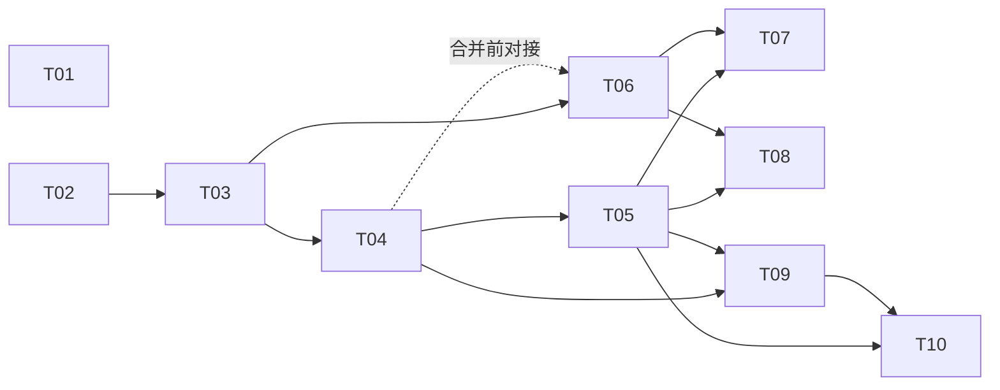
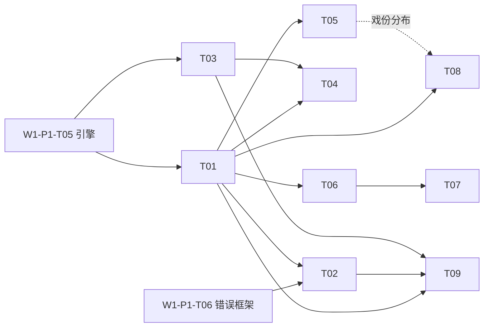

# Wave-01 就绪任务队列（ready-tasks，合并版）

> **本文件是各分支 ready-tasks 的分区并集**，由 W2 实现槽（分支 `cursor/w2-scaffold-ci-ccbf`）按 W1-A 盘点
> （`docs/wave-01/inventory-codebase.md` §4 注意事项 1）与 P4 版文件头的拼接约定组装，各分区**正文原样保留、未改写**：
>
> | 分区 | 来源分支 @ commit | 任务 ID 约定 |
> | --- | --- | --- |
> | P1 | `cursor/w1-p1-usability-architecture-5d0e @ 4612cdb` | `W{波次}-{槽位}-T{序号}` |
> | P3 | `cursor/w1-p3-agent-intelligence-ca4d @ 67e6670` | `TASK-P3-{序号}`（验收须二值可判定并标注证据类型 E1–E5，见 `maturity-baseline.md` §2） |
> | P4 | `cursor/w1-p4-major-experience-features-5fba @ 6ec86f8` | `W{波次}-{槽位}-T{序号}`（分区以 `<!-- BEGIN/END:P4 -->` 标记） |
>
> **未并入**：P2 分区仍在 `cursor/w1-p2-interaction-reliability-a3c2 @ 7873b66`（该分支不在本槽参考清单内，
> 后续合并时按同样方式取分区并集拼接，勿覆盖本文件）。
>
> **追加约定（对全文件生效，沿用各来源版本的共同规则）**：按槽位分区维护；各槽只追加/更新自己分区，
> **不得改写其他分区的任务定义**；任务状态变更（领取/完成）由执行槽位在对应条目下追加备注行
> （格式：`> 状态：<领取|完成> —— <槽位> / <日期> / <分支或commit>`）；任务 ID 全库唯一，被引用后不得复用或改义。

---

<!-- BEGIN:P1 -->
## 槽位 P1（功能易用性）— 就绪任务

来源方案：[`docs/wave-01/P1-usability-architecture.md`](./P1-usability-architecture.md)（下称"方案"）。任务按优先级排序（P0 最高）；同级内按编号顺序执行。文件范围中的技术栈路径以 TypeScript/Node 假设（方案 §3 A4）书写，若 ADR-0001 定为其他栈，仅路径后缀相应调整，任务本身不变。

### W1-P1-T01 · P0 · README 重写为路由页

- **目标**：将 README 从单行标题改造为"30 秒电梯陈述 + 可复制 Quickstart 骨架 + docs 分区链接"的路由页，满足方案 §6.6 的"三跳可达"起点。Quickstart 中尚未实现的命令须标注"规划中"。
- **文件范围**：`README.md`；新建 `docs/quickstart.md` 占位（含目标命令序列与"实现进度"标注）。
- **验收标准**：① README 首屏含产品一句话定位与主工作流五步示意；② 所有链接可解析（无死链）；③ 未实现功能均有"规划中"标注，无虚假可用性承诺。
- **风险**：产品定位表述依赖假设 A1，若调度器更正需小幅返工（仅文案）。
- **依赖**：无（可立即执行）。

> 状态：完成 —— W2 实现槽（脚手架+CI） / 2026-08-27 / `cursor/w2-scaffold-ci-ccbf`

### W1-P1-T02 · P0 · ADR-0001 技术栈与产品形态决策记录

- **目标**：确认或修订方案 §3 的假设 A1–A4，形成正式 ADR：产品形态（CLI 优先）、语言/运行时、包管理器、测试框架、导出格式首选项。
- **文件范围**：新建 `docs/adr/0001-stack-and-product-shape.md`（ADR 模板：背景/选项/决策/后果）。
- **验收标准**：① A1–A4 逐条给出"确认/修订"结论及理由；② 明确列出被否决选项与否决原因；③ 后续任务的文件范围若受影响，在 ADR 末尾给出勘误清单。
- **风险**：若调度器长期不答复 B1，ADR 以方案默认假设自决——需在 ADR 显著位置标注"默认执行，可被产品简报推翻"。
- **依赖**：无（可与 T01 并行）。

> 状态：完成 —— W2 实现槽（脚手架+CI） / 2026-08-27 / `cursor/w2-scaffold-ci-ccbf`（调度器已确认 A1–A4，见 `docs/adr/0001-stack-and-product-shape.md`）

### W1-P1-T03 · P0 · 项目脚手架与 CI 基线

- **目标**：按方案 §5.1/§6.1 建立仓库骨架与最小 CI（lint + typecheck + test 三件套），保证后续功能槽在绿色基线上开发。
- **文件范围**：`package.json`、`tsconfig.json`、lint 配置、`src/{core,app,cli,infra}/` 目录及占位模块、`.github/workflows/ci.yml`、`.gitignore`、`templates/` 目录占位。
- **验收标准**：① `npm test`/`npm run lint` 本地与 CI 均通过；② CI 在 PR 与 push 触发；③ 空跑 `sw --version` 可执行（入口打通）；④ 顶层目录与方案 §6.1 仓库 IA 一致。
- **风险**：栈选择未定即开工会返工——严格后置于 T02。
- **依赖**：T02。

> 状态：完成 —— W2 实现槽（脚手架+CI） / 2026-08-27 / `cursor/w2-scaffold-ci-ccbf`（验收对照见 `docs/wave-02/work-scaffold-ci.md` §3）

### W1-P1-T04 · P1 · 实现 SPEC-01 `sw init` 向导

- **目标**：按方案 §7 SPEC-01 实现交互式初始化（≤ 4 问）与 `--yes` 非交互模式，产出 v1 `project.yaml` 与项目目录脚手架。
- **文件范围**：`src/cli/commands/init.ts`、`src/app/workflow/init.ts`、`src/infra/store/projectFile.ts`、`templates/short-video/`（首个模板）、对应单测。
- **验收标准**：SPEC-01"验收要点"全项通过：≤ 4 问、`--yes` 零交互、目录布局符合 §6.1、重复 init 幂等报错（错误经 SPEC-03 框架，若 T06 未完成则暂用 TODO 标记并在 T06 合并前迁移）。
- **风险**：向导交互库选型影响测试性——优先选可注入 stdin 的实现以便自动化测试。
- **依赖**：T03；错误输出终态依赖 T06。

> 状态：完成 —— W2 实现槽（init 向导） / 2026-08-27 / `cursor/w2-init-wizard-87b4`（验收对照与偏差登记见 `docs/wave-02/work-init-wizard.md`；错误输出按约定以 TODO 标记待 T06 迁移）

### W1-P1-T05 · P1 · 实现 SPEC-02 状态文件与工作流引擎（最小版）

- **目标**：按方案 §7 SPEC-02 实现 `sw status / outline / draft / export`（export 先支持 Markdown 单格式），进度可恢复、输出含下一步可复制命令。
- **文件范围**：`src/app/workflow/engine.ts`、`src/cli/commands/{status,outline,draft,export}.ts`、`src/core/model/`（领域模型）、`src/infra/store/`（原子写）、对应单测与一条端到端脚本（init→draft→export 全链路）。
- **验收标准**：SPEC-02"验收要点"全项通过；端到端脚本在 CI 中运行并作为 TTFS 基准雏形。
- **风险**：范围最大的一项——若超载，按方案 §8 回退策略砍导出格式，不砍 status 可恢复性。
- **依赖**：T03、T04（消费其产出的 project.yaml）。

> 状态：领取 —— W2 实现槽（工作流引擎最小版） / 2026-08-27 / `cursor/w2-workflow-engine-4cad`
> （最小版已交付：恢复式引擎 + schema v1 解析 + 原子写 + `sw status`，引擎级端到端进 CI；
> `sw outline/draft/export` 子命令本体待后续槽，验收对照见 `docs/wave-02/work-workflow-engine.md` §3/§4）

### W1-P1-T06 · P1 · 实现 SPEC-03 统一错误与空态框架

- **目标**：按方案 §7 SPEC-03 落地错误码注册表、`fail()/hint()` 渲染层、`docs/errors/` 生成器与注册表 lint（进 CI）。
- **文件范围**：`src/app/errors/{registry,render}.ts`、`scripts/gen-error-docs.ts`、`docs/errors/`（生成物）、CI 工作流追加 lint 步骤、对应单测。
- **验收标准**：SPEC-03"验收要点"全项通过；T04 的错误输出已迁移到本框架（迁移作为本任务完成定义的一部分）。
- **风险**：先于足量错误场景落框架可能过度设计——注册表 v1 只收 SPEC-01/02 实际触达的错误码（约 6–8 个），禁止预填未用码。
- **依赖**：T03；与 T04 可并行开发、合并前对接。

> 状态：完成 —— W2 实现槽（错误框架+退出码） / 2026-08-27 / `cursor/w2-error-framework-exit-codes-f4d4`（注册表 v1 收 4 码 E010/E011/E020/E030 + 2 空态位点；「T04 错误输出迁移」按本条目"合并前对接"约定转记为 T04 分支合并前对接项——T04 在并行分支开发、尚未合入基线，对接清单见 `docs/wave-02/work-error-framework.md` §5）

- **目标**：内置 3 个模板（screenplay / short-video / podcast），并为 `outline.md` 空态、`scenes/` 空态接入 `hint()` 引导（方案 §6.3 空态三要素）。
- **文件范围**：`templates/{screenplay,podcast}/`（short-video 已由 T04 建立）、`src/app/workflow/` 空态位点接线、模板渲染单测。
- **验收标准**：① `sw init --template` 三选一均产出可 export 的项目；② 空态覆盖率清单（方案 §4）中已知位点 100% 有引导且含可复制命令。
- **风险**：模板内容质量主观——验收聚焦结构完整与占位变量正确，文案质量留给后续内容槽。
- **依赖**：T04、T05、T06。

### W1-P1-T08 · P2 · `sw doctor` 配置诊断命令

- **目标**：按方案 §6.7 实现 doctor：检查运行时版本、项目文件完整性、`progress.scenes_done` 与磁盘一致性、AI key 有效性（若启用），每项绿/红 + 修复命令。
- **文件范围**：`src/cli/commands/doctor.ts`、`src/app/diagnostics/`、对应单测。
- **验收标准**：① 在健康项目输出全绿；② 人为制造 3 类损坏（删 project.yaml、改坏 schema、scenes_done 与磁盘不符）各得到含修复命令的红项；③ 退出码：全绿 0，否则 1。
- **风险**：低。检查项清单会随功能增长——在代码中以可注册检查项数组组织，避免巨型函数。
- **依赖**：T05、T06。

### W1-P1-T09 · P2 · 用户文档 IA 落地

- **目标**：按方案 §6.6 建立 `docs/quickstart.md`（补全 T01 占位）、`docs/concepts/`（领域词汇表）、`docs/reference/`（命令逐条，含 ≥1 可复制示例）并接通互链闭环（help ↔ docs ↔ 错误锚点）。
- **文件范围**：`docs/quickstart.md`、`docs/concepts/glossary.md`、`docs/reference/*.md`、README 链接更新、链接检查脚本进 CI。
- **验收标准**：① 三跳可达 100%（链接检查通过）；② 每条已实现命令有 reference 页且示例可执行；③ `--help` 尾部 URL 指向对应 reference 页。
- **风险**：文档与实现漂移——链接检查 + help 快照测试（T10 可复用）缓解。
- **依赖**：T04、T05（需有已实现命令可写）。

### W1-P1-T10 · P3 · 易用性度量：TTFS 基准与 help 快照测试

- **目标**：把方案 §4 指标中可自动化的两项固化进 CI：TTFS 新手路径回放脚本（步数/命令数断言）与全部子命令的 `--help` 快照测试（含"≥1 示例"断言）。
- **文件范围**：`scripts/ttfs-bench.sh`（或 .ts）、`tests/help-snapshots/`、CI 工作流追加步骤。
- **验收标准**：① TTFS 脚本断言"≤ 5 条命令产出导出文件"，失败即 CI 红；② help 快照对全部子命令生效，新增命令未附示例会失败。
- **风险**：快照测试易碎——快照仅锁"含示例段落"等结构性断言，不锁全文。
- **依赖**：T05、T09。

### 任务依赖总览

<!-- END:P1 -->

---

<!-- BEGIN:P3 -->
## P3 分区：Agent 智能化（登记于 2026-08-27，来源 `docs/wave-01/P3-agent-intelligence.md`）

### 队列总览

| ID | 目标一句话 | 阶段 | 依赖 | 优先级 |
|----|-----------|------|------|--------|
| TASK-P3-01 | 模型网关最小实现，完成一次真实调用并脱敏存档 | 一 | BLK-W1-01、BLK-W1-02 解除 | P0 |
| TASK-P3-02 | 提示词库与技能注册（规则/技能/版本化） | 一(最小)→二(完整) | TASK-P3-01 | P0 |
| TASK-P3-03 | 受控输出层（schema 校验 + F1 重试降级） | 二 | TASK-P3-01/02 | P0 |
| TASK-P3-04 | 运行轨迹 trace 最小实现 | 一 | TASK-P3-01 | P0 |
| TASK-P3-05 | 工具注册表 + 首批只读工具 | 三 | TASK-P3-03；P1 的剧本存储可寻址 | P1 |
| TASK-P3-06 | Story Bible 数据结构 + 上下文组装器 v1 | 三 | TASK-P3-05 | P1 |
| TASK-P3-07 | 工作流引擎（静态计划执行 + 断点续跑） | 四 | TASK-P3-03/04 | P1 |
| TASK-P3-08 | WF-01 Logline→分场大纲工作流落地 | 四 | TASK-P3-07/09、SPEC-P3-02 | P2 |
| TASK-P3-09 | 意图澄清模块 v1 | 四 | TASK-P3-03 | P2 |
| TASK-P3-10 | 失败自修复策略表落地 + 输出质量抽检流程 | 二(前半)→五(后半) | TASK-P3-03/04 | P2 |

> 阶段编号对应 `docs/wave-01/P3-agent-intelligence.md` §4 实施顺序；P0 = 解锁 GOAL-W1-03 / C-L2 的关键路径。

### 任务明细

#### TASK-P3-01 模型网关最小实现

- **目标**：建立唯一的模型调用出口（供应商适配、超时、重试 F3、凭据从环境注入且永不落盘），并完成一次返回剧本相关内容的真实调用。直接对应 GOAL-W1-03。
- **建议文件**：`src/agent/gateway/`（客户端、供应商适配、配置）；`docs/evidence/` 下调用脱敏记录。扩展名按选型定（BLK-W1-01）。
- **验收（二值）**：E1 模块入主分支；E4 一次真实调用的请求/响应脱敏记录存档且内容与剧本创作相关；仓库全文检索不到任何凭据明文。
- **依赖**：BLK-W1-01、BLK-W1-02 解除。凭据未到位期间可先以录制/回放模式开发（方案 R-2），但验收必须有真实调用。

#### TASK-P3-02 提示词库与技能注册

- **目标**：建立 `prompts/rules|skills|schemas` 三层结构与加载器；最小版交付 1 条规则 + 1 个技能（建议 `generate_outline` 或 `rewrite_scene`）；完整版交付版本化（`id@version`）与注册时校验。
- **建议文件**：`prompts/rules/base.md`、`prompts/skills/<skill>.md`、`prompts/schemas/*.json`、`src/agent/prompts/`（加载器与注册表）。
- **验收（二值）**：E1 结构入库；E3 加载器测试：合法技能可加载、缺 `output_schema` 或槽位不匹配的技能被拒载；trace 中的技能引用含版本号（E4 一条运行记录佐证）。
- **依赖**：TASK-P3-01。

#### TASK-P3-03 受控输出层

- **目标**：所有 `skill:*` 调用输出经 JSON Schema 校验；F1 策略落地（带错误反馈重试 ≤2 次，仍失败降级为"纯文本草稿+需人工确认"），杜绝不受控输出进入业务逻辑。
- **建议文件**：`src/agent/orchestrator/output-guard`、`prompts/schemas/`。
- **验收（二值）**：E3 测试覆盖三种路径：一次通过 / 重试后通过 / 降级；E4 一次真实 F1 重试的 trace 记录（`repair_event` 含失败码与结果）。
- **依赖**：TASK-P3-01/02。

#### TASK-P3-04 运行轨迹 trace 最小实现

- **目标**：JSONL 事件流落盘（最小事件集：`run_start/run_end/llm_call/repair_event`），含 token、延迟、技能版本、上下文槽位引用；`runs/` 进 gitignore，脱敏摘要可导出到 `docs/evidence/`。
- **建议文件**：`src/agent/trace/`、`.gitignore` 追加 `runs/`。
- **验收（二值）**：E4 一次运行产出的 JSONL 文件包含全部最小事件且字段齐全；E3 脱敏导出测试：导出物中无凭据、无剧本正文全文（仅引用）。
- **依赖**：TASK-P3-01。

#### TASK-P3-05 工具注册表 + 首批只读工具

- **目标**：工具描述 schema（含 `side_effect/preconditions/failure_modes`）与注册表校验；实现首批只读工具 `read_scene / list_scenes / get_bible_entry`；F2 前置参数校验生效。
- **建议文件**：`src/agent/tools/registry`、`src/agent/tools/read_scene` 等、工具描述与实现同目录。
- **验收（二值）**：E3 注册表拒载非法描述的测试通过；三个工具对测试剧本返回正确结果的测试通过；E4 一次经模型发起的工具调用 trace。
- **依赖**：TASK-P3-03；P1 侧剧本存储满足"分场可寻址"（方案 §6 R-4）。

#### TASK-P3-06 Story Bible + 上下文组装器 v1

- **目标**：定稿人物卡/地点/伏笔 schema（`story-bible/`）；上下文组装器按方案 §2.3 预算表拼装（v1 确定性检出，不做向量检索），组装明细写入 trace。
- **建议文件**：`story-bible/README.md`（schema 说明）、`story-bible/characters/*.yaml`、`src/agent/context/assembler`。
- **验收（二值）**：E3 组装器测试：给定场号与人物，产物包含目标场全文、相邻场概要、对应人物卡，且各槽位不超预算；E4 trace 中 `context_slots` 字段与实际一致。
- **依赖**：TASK-P3-05。

#### TASK-P3-07 工作流引擎

- **目标**：静态计划模板实例化与执行（步骤类型 `tool/skill/human`）；`human:*` 节点挂起→序列化→续跑；预算硬顶（F4）生效。
- **建议文件**：`src/agent/orchestrator/workflow`、`src/agent/orchestrator/plans/`（模板）。
- **验收（二值）**：E3 测试：含 human 节点的模板可挂起并续跑、超预算计划被截停且返回断点句柄；E4 一次完整工作流 trace（含 `human_gate` 事件）。
- **依赖**：TASK-P3-03/04。

#### TASK-P3-08 WF-01 Logline→分场大纲落地

- **目标**：按 SPEC-P3-02 实现引导式大纲工作流（梗概→分幕→分场，每步人审，产出人物卡草稿）。
- **建议文件**：`src/agent/orchestrator/plans/wf-01`、`prompts/skills/generate_synopsis|generate_acts|generate_outline.md` 及配套 schema。
- **验收（二值）**：SPEC-P3-02 验收标准原文照抄执行（≥10 场大纲 + ≥2 张人物卡草稿 + 挂起续跑 1 次，E4 存档）。
- **依赖**：TASK-P3-07/09；规格 SPEC-P3-02。

#### TASK-P3-09 意图澄清模块 v1

- **目标**：按方案 §2.5 实现三条触发规则、≤2 问预算、超预算转显式默认假设；澄清问答落 trace 与会话层。
- **建议文件**：`src/agent/orchestrator/clarifier`。
- **验收（二值）**：E3 测试覆盖：必填槽位缺失触发澄清 / 槽位齐全不触发 / 超预算走默认假设且结果头部含假设声明；E4 一次真实澄清往返 trace（`clarify_event`）。
- **依赖**：TASK-P3-03。

#### TASK-P3-10 失败自修复策略表落地 + 抽检流程

- **目标**：前半（阶段二）：策略表 F1–F3 以配置落地并接入编排层；后半（阶段五）：建立输出质量抽检流程（抽样 run → 人工评定连贯性/事实一致 → 记录存档），产出 C-L3 所需抽检记录。
- **建议文件**：`src/agent/orchestrator/repair-policy`、`docs/evidence/spot-checks/`（抽检记录模板与存档）。
- **验收（二值）**：前半：E3 各失败码策略路径测试通过（可用注入故障方式）；后半：E5 首批 ≥5 条抽检记录存档，每条含 run_id、评定项、结论。
- **依赖**：TASK-P3-03/04。

### 领取与状态约定

- 领取任务的执行槽位在对应任务明细末尾追加一行：`> 状态：<领取|完成> —— <槽位> / <日期> / <分支或commit>`。
- 完成判定以验收标准逐条核对为准，证据不合格视为未完成（与基线 §2 证据三要素一致）。
<!-- END:P3 -->

---

<!-- BEGIN:P4 -->
## P4 重大工具体验功能（Major Experience Features）

- 来源方案：[`docs/wave-01/P4-major-experience-features.md`](./P4-major-experience-features.md)（含每项功能的问题/方案/影响面/工作量/验收/贴合点全文，本表为任务索引 + 明细）
- 产出分支：`cursor/w1-p4-major-experience-features-5fba`
- 公共前置：W1-P1-T02（ADR 定栈）→ W1-P1-T03（脚手架）→ W1-P1-T05（引擎与领域模型）、W1-P1-T06（错误框架）。下表「依赖」列只写直接前置。
- 工作量为技术规模（S/M/L），非日历时间。

### 总览

| 任务 ID | 名称 | 对应功能 | 优先级 | 工作量 | 依赖 | 状态 |
| --- | --- | --- | --- | --- | --- | --- |
| W1-P4-T01 | 内容索引层 | 公共地基 | P0 | M | W1-P1-T05 | ready（待 P1 引擎） |
| W1-P4-T02 | `sw check` 一致性规则引擎 | F1 | P0 | M | T01、W1-P1-T06 | blocked(T01) |
| W1-P4-T03 | 快照存储与 snapshot/restore | F2 | P0 | M | W1-P1-T05、W1-P1-T06 | ready（待 P1 引擎） |
| W1-P4-T04 | history/diff 场景级时间线 | F2 | P1 | M | T01、T03 | blocked(T03) |
| W1-P4-T05 | `sw character` 角色卡与出场索引 | F3 | P1 | M | T01、台词语法 ADR | blocked(T01) |
| W1-P4-T06 | 导出管线插件化 + Fountain | F5 | P1 | M–L | T01、W1-P1-T05、台词语法 ADR | blocked(T01) |
| W1-P4-T07 | PDF 版式导出与标题页 | F5 | P2 | L | T06 | blocked(T06) |
| W1-P4-T08 | `sw stats` 统计与节奏视图 | F4 | P2 | S–M | T01（`--by character` 还需 T05） | blocked(T01) |
| W1-P4-T09 | `sw move/renumber/remove` 结构事务 | F6 | P2 | M | T01、T02、T03 | blocked(T02,T03) |

### 任务明细

#### W1-P4-T01 · P0 · 内容索引层（场景/角色/大纲解析与项目索引）

- **目标**：把 `outline.md`、`scenes/*.md`、`characters/*.md` 解析为 core 领域模型的只读索引（含台词署名解析、mtime 缓存），作为 T02/T05/T06/T08/T09 的唯一取数面，杜绝各功能重复造解析器。
- **文件范围**：`src/app/index/`（索引构建与缓存）、`src/core/model/` 补充解析目标类型、单测与解析夹具。
- **验收标准**：① 夹具项目解析结果与人工标注一致（场景清单、署名、大纲条目）；② mtime 缓存命中时不重读未变更文件（以 IO 计数断言）；③ 解析器对畸形文件不抛裸异常，产出结构化「不可解析」条目（供 T02 出规则告警）；④ core 层零 IO（依赖方向 lint 或架构测试）。
- **风险**：台词署名语法未定——本任务先支持模板既有语法，语法 ADR 定案后仅改解析规则常量。
- **依赖**：W1-P1-T05。

#### W1-P4-T02 · P0 · `sw check` 一致性规则引擎与初版规则集（F1）

- **目标**：规则引擎 + `SW-Cxxx` 规则注册表（与 SPEC-03 同库同 lint），初版 ≥8 条内容一致性规则，`--fix` 白名单 + dry-run 默认，退出码可进 CI。
- **文件范围**：`src/app/check/`、CLI 子命令、SPEC-03 注册表扩段与 `docs/errors/`（或 `docs/checks/`）生成、每规则正反例夹具。
- **验收标准**：主文档 F1 验收 ①–⑤ 全项（规则数、三段式输出、fix 语义、50 场 <1s、退出码测试）。
- **风险**：规则误报伤信任——初版规则以「结构可判定」为准入，语义类规则（如剧情连贯）一律不收。
- **依赖**：T01、W1-P1-T06。

#### W1-P4-T03 · P0 · 快照存储与 `sw snapshot/restore`（F2 前半）

- **目标**：`.sw/history/` 内容寻址快照存储适配器 + snapshot/restore 命令；恢复走原子事务且前置自动安全快照；附「状态 vs 存档」补充 ADR（建议 ADR-0002，定案「删 `.sw/` 主工作流行为不变」边界）。
- **文件范围**：`src/infra/history/`、`src/app/history/`、CLI 两个子命令、`.gitignore` 模板项、`docs/adr/0002-*.md`、单测（含 kill -9 原子性）。
- **验收标准**：主文档 F2 验收 ①③④⑥（往返一致、安全快照、原子性、删 `.sw/` 行为不变）；ADR 合入。
- **风险**：内容寻址实现易过度设计——初版只需哈希去重 + index.yaml，禁止引入打包/压缩/GC（登记为后续任务）。
- **依赖**：W1-P1-T05、W1-P1-T06。

#### W1-P4-T04 · P1 · `sw history/diff` 场景级时间线与对比（F2 后半）

- **目标**：项目级/单场级时间线查询；场景粒度 diff（台词/动作行级渲染，80 列可读）；`restore --scene` 单场恢复。
- **文件范围**：`src/app/history/` 扩展、CLI 两个子命令、diff 渲染器与结构性快照测试。
- **验收标准**：主文档 F2 验收 ②⑤（单场恢复后 doctor/check 全绿、diff 快照测试）。
- **风险**：diff 渲染打磨无底——验收只锁结构断言（分段、标签、列宽），不锁视觉细节。
- **依赖**：T01、T03。

#### W1-P4-T05 · P1 · `sw character` 角色卡与出场索引（F3）

- **目标**：角色卡 CRUD（add/list/show）、frontmatter schema（含别名表）、出场矩阵与台词行数统计、与 T02 的「未建卡署名」warn 联动。
- **文件范围**：`src/core/model/character.ts`、CLI 子命令组、`templates/*/characters/` 示例卡、索引层署名归并逻辑、单测。
- **验收标准**：主文档 F3 验收 ①–⑤ 全项。
- **风险**：别名归并的边界情形（全半角、大小写、昵称）——初版只做显式别名表归并，不做模糊匹配。
- **依赖**：T01；台词语法 ADR（与 W1-P1-T07 对齐，先开工者定案）。

#### W1-P4-T06 · P1 · 导出管线插件化 + Fountain 导出（F5 前半）

- **目标**：`Exporter` 插件接口与注册表；把 W1-P1-T05 的 Markdown 导出迁移为首个插件（行为不变）；交付 Fountain 完整语法插件；`settings.export.presets` 与 `--preset` 旗标。
- **文件范围**：`src/app/export/`、`src/infra/export/fountain/`、project.yaml schema 扩展、CLI 旗标、round-trip 测试。
- **验收标准**：主文档 F5 验收 ①④⑤⑥（Fountain round-trip、多格式并存与模板默认、错误走 SPEC-03、md 插件迁移不回退）。
- **风险**：与 T05 的台词语法耦合——Fountain 映射表以语法 ADR 为唯一输入，ADR 未定前先落插件接口与 md 迁移。
- **依赖**：T01、W1-P1-T05；台词语法 ADR。

#### W1-P4-T07 · P2 · PDF 版式导出与标题页（F5 后半）

- **目标**：标准 screenplay 版式 PDF 插件（US Letter/A4）+ 标题页生成；渲染库选型 spike + 补充 ADR。
- **文件范围**：`src/infra/export/pdf/`、版式量化断言测试（页边距/缩进列位）、`docs/adr/` 选型 ADR。
- **验收标准**：主文档 F5 验收 ②③（版式量化断言、标题页字段完整）。
- **风险**：PDF 库重依赖/平台差异——spike 先行，选型不通过则本任务降级为「Fountain → 外部工具链」文档方案并回报调度器。
- **依赖**：T06。

#### W1-P4-T08 · P2 · `sw stats` 统计与节奏视图（F4）

- **目标**：项目/单场统计（字数、预计时长、每场长度条形图）、`--by character` 戏份分布；折算参数由模板声明。
- **文件范围**：`src/app/stats/`（计算核心纯函数）、CLI 子命令、模板 schema 折算参数、单测。
- **验收标准**：主文档 F4 验收 ①–⑤ 全项。
- **风险**：低。折算参数缺省时按格式给内置默认并在输出注明来源。
- **依赖**：T01；`--by character` 部分依赖 T05（可分两步交付）。

#### W1-P4-T09 · P2 · `sw move/renumber/remove` 结构重构事务（F6）

- **目标**：三处一致性事务（文件名/大纲结构化引用/progress）+ 操作前自动安全快照 + `.sw/trash/` 可恢复删除；自由文本引用不改、由 T02 出 warn。
- **文件范围**：`src/app/structure/`、CLI 子命令组、事务与中断测试、trash 恢复测试。
- **验收标准**：主文档 F6 验收 ①–⑤ 全项。
- **风险**：大纲同步策略——初版仅同步结构化引用（编号/锚点），把自然语言理解显式排除在范围外。
- **依赖**：T01、T02（回归手段）、T03（安全快照原语）。

### 任务依赖总览

**建议开工顺序**：T01 → T02 + T03 并行 → T04 / T05 / T06 → T07 / T08 / T09。
<!-- END:P4 -->

---

<!-- BEGIN:WAVE02-PLAN -->
## WAVE02-PLAN 分区：G1 缺口补登记（登记于 2026-08-27，第 2 波计划槽）

- **登记依据**：W1-C 链路盘点 `docs/wave-01/inventory-agent-tooling.md` @ `8553c7f` §7.1 缺口 G1——P3 第二/三批共 5 个工具（`write_scene_draft`、`upsert_bible_draft`、`search_script`、`consistency_check`、`format_lint`）与工作流 WF-02/03 在 ready-tasks 无独立任务 ID，仅以 SPEC 依赖形式存在，实现槽无法按「领取与状态约定」认领，W5 无对账锚点。
- **登记方式**：遵守 W1-C §7.1 处置建议与本文件追加约定——**只新增本分区，不改写 P3 分区**（TASK-P3-01…10 定义原样有效）；以 SPEC-P3-01/02/03 为立项单元拆解。
- **权威来源**：工具行为契约见 P3 方案 `docs/wave-01/P3-agent-intelligence.md` @ `67e6670` §2.1 首批工具表；工作流行为契约与验收见同文档 §5（SPEC-P3-01/02/03）。本分区不复述架构正文，只登记任务锚点。
- **任务 ID 格式**：`W2-PLAN-T{序号}`（兼容 P1/P4 分区的 `W{波次}-{槽位}-T{序号}` 约定），全库唯一，被引用后不得复用或改义。
- **排序与协调**：波内梯队位置与跨槽协调项（D1–D7）见 `docs/wave-02/implementation-backlog.md` §2/§3；涉及协调项的任务领取时在状态行注明「按 Dx 执行」。

### 队列总览

| ID | 目标一句话 | 对账锚点（W1-C §5/§6） | 依赖 | 优先级 |
| --- | --- | --- | --- | --- |
| W2-PLAN-T01 | 第二批草稿写工具 `write_scene_draft` + `upsert_bible_draft` | 工具 T4、T5 | TASK-P3-03/05 | P1 |
| W2-PLAN-T02 | 第二批检索工具 `search_script` | 工具 T6 | TASK-P3-05、W1-P4-T01 | P2 |
| W2-PLAN-T03 | SPEC-P3-01 一致性守卫（`consistency_check` 工具 + WF-03 巡检工作流） | 工具 T7、工作流 WF-03 | TASK-P3-05/06/07 | P1 |
| W2-PLAN-T04 | SPEC-P3-03 场景改写助手（WF-02 工作流落地） | 工作流 WF-02 | W2-PLAN-T01/T03、TASK-P3-03/06/09 | P1 |
| W2-PLAN-T05 | 第三批格式工具 `format_lint` | 工具 T8 | TASK-P3-05（宜后置 W1-P4-T02） | P2 |

### 任务明细

#### W2-PLAN-T01 · P1 · 第二批草稿写工具 `write_scene_draft` + `upsert_bible_draft`

- **目标**：按 P3 §2.1 实现两个 `draft_write` 工具——写入场景草稿并返回差异预览、提议设定集条目变更（同走草稿）；任何路径不触 M1 权威层，直到用户显式采纳（原则 P-3）。供 WF-01 采纳步与 WF-02 草稿步消费。
- **建议文件**：`src/agent/tools/write_scene_draft`、`src/agent/tools/upsert_bible_draft`（描述与实现同目录，注册进 TASK-P3-05 注册表）。
- **验收（二值）**：E3 测试：① 草稿写入后原稿哈希不变；② 差异预览与草稿内容一致；③ 两工具描述通过注册表 schema 校验（含 `side_effect: draft_write`、`preconditions`、`failure_modes`）；E4 一次经模型发起的 `draft_write` 调用 trace（含 `tool_call` 事件）。
- **依赖**：TASK-P3-03（受控输出）、TASK-P3-05（注册表）。采纳写入时刻建议叠加 W1-P4-T03 安全快照原语（协调项 D4，接口以 P4-T03 交付为准）。

#### W2-PLAN-T02 · P2 · 第二批检索工具 `search_script`

- **目标**：按 P3 §2.1 实现关键词/人物名检索剧本正文的只读工具；**建于 W1-P4-T01 内容索引层之上，不得自带解析器**（协调项 D3，P4-T01 为唯一取数面）。
- **建议文件**：`src/agent/tools/search_script`。
- **验收（二值）**：E3 测试：对测试剧本夹具的检索命中/漏检断言（关键词、人物名、别名归并各 ≥1 例）通过；工具描述通过注册表校验；E4 一次经模型发起的工具调用 trace。
- **依赖**：TASK-P3-05、W1-P4-T01。

#### W2-PLAN-T03 · P1 · SPEC-P3-01 一致性守卫（`consistency_check` 工具 + WF-03 巡检工作流）

- **目标**：按 SPEC-P3-01 行为契约实现：对指定范围（全本/场号区间/单场草稿）抽取事实断言并与 Story Bible `facts` 及前文比对，输出冲突报告（场号/描述/依据/置信度/修复建议），**只报告不改写**（F5）；单场抽取失败标注「未检查」，杜绝假阴性（未完成检查 ≠ 无冲突）。工具形态供 WF-02 后置步复用；工作流形态即 WF-03 巡检（全本扫描 → 冲突报告 → 逐条修复建议）。
- **建议文件**：`src/agent/tools/consistency_check`、`src/agent/orchestrator/plans/wf-03`、配套冲突列表 schema（`prompts/schemas/`）。
- **验收（二值）**：SPEC-P3-01 验收标准原文照抄执行——构造含 ≥3 个已知矛盾的测试剧本，报告命中全部预埋矛盾（E3/E4 存档）；对无矛盾文本高置信度误报 ≤1 条。另加：报告中含 ≥1 条「未检查」标注路径的测试（注入单场抽取失败）。
- **依赖**：TASK-P3-05（工具）、TASK-P3-06（Story Bible）、TASK-P3-07（工作流引擎，WF-03 形态需要）。与 W1-P4-T02 结构规则引擎的分工按协调项 D2 执行（本任务只做语义/事实类，不收结构可判定规则）。

#### W2-PLAN-T04 · P1 · SPEC-P3-03 场景改写助手（WF-02 工作流落地）

- **目标**：按 SPEC-P3-03 行为契约实现 WF-02：`scene_id` + 自然语言指令（缺 `scene_id` 触发澄清）→ 组装上下文 → `rewrite_scene` 技能产出受控草稿 → 自动 `consistency_check` 后置步（冲突以警示随差异呈现，不阻断交付）→ 差异预览 + 改动说明；原稿安全同 P-3。
- **建议文件**：`src/agent/orchestrator/plans/wf-02`、`prompts/skills/rewrite_scene.md` 及配套 schema。
- **验收（二值）**：SPEC-P3-03 验收标准原文照抄执行——对含既定事实的测试场景执行改写：草稿保留全部 `facts` 相关事实且体现指令要求（人工判定记录存档，E4）；连续 3 次运行无崩溃、原稿哈希不变（E4）。
- **依赖**：W2-PLAN-T01（草稿写工具）、W2-PLAN-T03（`consistency_check` 工具形态）、TASK-P3-03（受控输出）、TASK-P3-06（上下文组装）、TASK-P3-09（澄清）。

#### W2-PLAN-T05 · P2 · 第三批格式工具 `format_lint`

- **目标**：按 P3 §2.1 实现剧本格式规范检查工具（场头/角色名/对白缩进等）。实现取向按协调项 D2：**包装复用 W1-P4-T02 `sw check` 规则引擎的格式类规则**，工具层只做注册与调用适配，禁止第二套规则引擎。
- **建议文件**：`src/agent/tools/format_lint`（适配层）。
- **验收（二值）**：E3 正反例夹具测试：≥3 类格式违规检出、无违规文本零报告；工具描述通过注册表校验；E4 一次经模型发起的工具调用 trace。
- **依赖**：TASK-P3-05；宜后置 W1-P4-T02（复用其规则引擎）。若 P4-T02 长期未就绪需提前，须先在本条目追加修订记录登记「独立最小规则集 + 后续回收合并」的偏离决定，不得静默双立引擎。

### 领取与状态约定

沿用 P3 分区约定：领取任务的执行槽位在对应任务明细末尾追加一行 `> 状态：<领取|完成> —— <槽位> / <日期> / <分支或commit>`；完成判定以验收标准逐条核对为准，证据不合格视为未完成。涉及协调项（D2/D3/D4）的任务，状态行须注明「按 Dx 执行」。
<!-- END:WAVE02-PLAN -->
