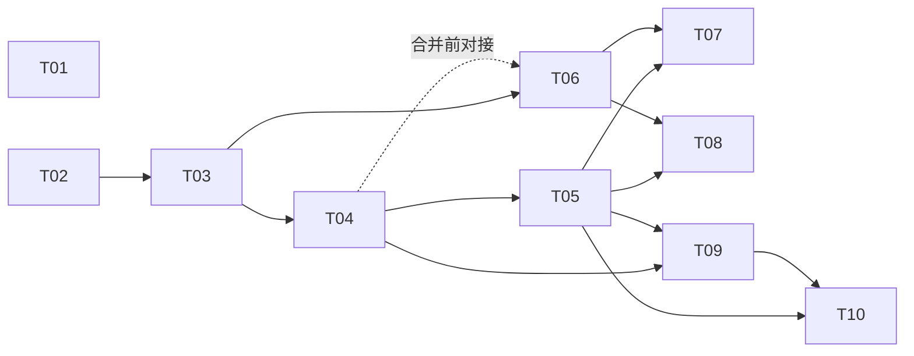

# Wave-01 就绪任务队列（ready-tasks）

> **追加约定**：本文件按"槽位标题"分区。各槽位只在自己的分区内追加/更新任务，**不得改写其他槽位分区的内容**。任务 ID 格式：`W{波次}-{槽位}-T{序号}`，全库唯一，被引用后不得复用或改义。

---

## 槽位 P1（功能易用性）— 就绪任务

来源方案：[`docs/wave-01/P1-usability-architecture.md`](./P1-usability-architecture.md)（下称"方案"）。任务按优先级排序（P0 最高）；同级内按编号顺序执行。文件范围中的技术栈路径以 TypeScript/Node 假设（方案 §3 A4）书写，若 ADR-0001 定为其他栈，仅路径后缀相应调整，任务本身不变。

### W1-P1-T01 · P0 · README 重写为路由页

- **目标**：将 README 从单行标题改造为"30 秒电梯陈述 + 可复制 Quickstart 骨架 + docs 分区链接"的路由页，满足方案 §6.6 的"三跳可达"起点。Quickstart 中尚未实现的命令须标注"规划中"。
- **文件范围**：`README.md`；新建 `docs/quickstart.md` 占位（含目标命令序列与"实现进度"标注）。
- **验收标准**：① README 首屏含产品一句话定位与主工作流五步示意；② 所有链接可解析（无死链）；③ 未实现功能均有"规划中"标注，无虚假可用性承诺。
- **风险**：产品定位表述依赖假设 A1，若调度器更正需小幅返工（仅文案）。
- **依赖**：无（可立即执行）。

### W1-P1-T02 · P0 · ADR-0001 技术栈与产品形态决策记录

- **目标**：确认或修订方案 §3 的假设 A1–A4，形成正式 ADR：产品形态（CLI 优先）、语言/运行时、包管理器、测试框架、导出格式首选项。
- **文件范围**：新建 `docs/adr/0001-stack-and-product-shape.md`（ADR 模板：背景/选项/决策/后果）。
- **验收标准**：① A1–A4 逐条给出"确认/修订"结论及理由；② 明确列出被否决选项与否决原因；③ 后续任务的文件范围若受影响，在 ADR 末尾给出勘误清单。
- **风险**：若调度器长期不答复 B1，ADR 以方案默认假设自决——需在 ADR 显著位置标注"默认执行，可被产品简报推翻"。
- **依赖**：无（可与 T01 并行）。

### W1-P1-T03 · P0 · 项目脚手架与 CI 基线

- **目标**：按方案 §5.1/§6.1 建立仓库骨架与最小 CI（lint + typecheck + test 三件套），保证后续功能槽在绿色基线上开发。
- **文件范围**：`package.json`、`tsconfig.json`、lint 配置、`src/{core,app,cli,infra}/` 目录及占位模块、`.github/workflows/ci.yml`、`.gitignore`、`templates/` 目录占位。
- **验收标准**：① `npm test`/`npm run lint` 本地与 CI 均通过；② CI 在 PR 与 push 触发；③ 空跑 `sw --version` 可执行（入口打通）；④ 顶层目录与方案 §6.1 仓库 IA 一致。
- **风险**：栈选择未定即开工会返工——严格后置于 T02。
- **依赖**：T02。

### W1-P1-T04 · P1 · 实现 SPEC-01 `sw init` 向导

- **目标**：按方案 §7 SPEC-01 实现交互式初始化（≤ 4 问）与 `--yes` 非交互模式，产出 v1 `project.yaml` 与项目目录脚手架。
- **文件范围**：`src/cli/commands/init.ts`、`src/app/workflow/init.ts`、`src/infra/store/projectFile.ts`、`templates/short-video/`（首个模板）、对应单测。
- **验收标准**：SPEC-01"验收要点"全项通过：≤ 4 问、`--yes` 零交互、目录布局符合 §6.1、重复 init 幂等报错（错误经 SPEC-03 框架，若 T06 未完成则暂用 TODO 标记并在 T06 合并前迁移）。
- **风险**：向导交互库选型影响测试性——优先选可注入 stdin 的实现以便自动化测试。
- **依赖**：T03；错误输出终态依赖 T06。

### W1-P1-T05 · P1 · 实现 SPEC-02 状态文件与工作流引擎（最小版）

- **目标**：按方案 §7 SPEC-02 实现 `sw status / outline / draft / export`（export 先支持 Markdown 单格式），进度可恢复、输出含下一步可复制命令。
- **文件范围**：`src/app/workflow/engine.ts`、`src/cli/commands/{status,outline,draft,export}.ts`、`src/core/model/`（领域模型）、`src/infra/store/`（原子写）、对应单测与一条端到端脚本（init→draft→export 全链路）。
- **验收标准**：SPEC-02"验收要点"全项通过；端到端脚本在 CI 中运行并作为 TTFS 基准雏形。
- **风险**：范围最大的一项——若超载，按方案 §8 回退策略砍导出格式，不砍 status 可恢复性。
- **依赖**：T03、T04（消费其产出的 project.yaml）。

### W1-P1-T06 · P1 · 实现 SPEC-03 统一错误与空态框架

- **目标**：按方案 §7 SPEC-03 落地错误码注册表、`fail()/hint()` 渲染层、`docs/errors/` 生成器与注册表 lint（进 CI）。
- **文件范围**：`src/app/errors/{registry,render}.ts`、`scripts/gen-error-docs.ts`、`docs/errors/`（生成物）、CI 工作流追加 lint 步骤、对应单测。
- **验收标准**：SPEC-03"验收要点"全项通过；T04 的错误输出已迁移到本框架（迁移作为本任务完成定义的一部分）。
- **风险**：先于足量错误场景落框架可能过度设计——注册表 v1 只收 SPEC-01/02 实际触达的错误码（约 6–8 个），禁止预填未用码。
- **依赖**：T03；与 T04 可并行开发、合并前对接。

### W1-P1-T07 · P2 · 模板库 v1 与空态引导

- **目标**：内置 3 个模板（screenplay / short-video / podcast），并为 `outline.md` 空态、`scenes/` 空态接入 `hint()` 引导（方案 §6.3 空态三要素）。
- **文件范围**：`templates/{screenplay,podcast}/`（short-video 已由 T04 建立）、`src/app/workflow/` 空态位点接线、模板渲染单测。
- **验收标准**：① `sw init --template` 三选一均产出可 export 的项目；② 空态覆盖率清单（方案 §4）中已知位点 100% 有引导且含可复制命令。
- **风险**：模板内容质量主观——验收聚焦结构完整与占位变量正确，文案质量留给后续内容槽。
- **依赖**：T04、T05、T06。

### W1-P1-T08 · P2 · `sw doctor` 配置诊断命令

- **目标**：按方案 §6.7 实现 doctor：检查运行时版本、项目文件完整性、`progress.scenes_done` 与磁盘一致性、AI key 有效性（若启用），每项绿/红 + 修复命令。
- **文件范围**：`src/cli/commands/doctor.ts`、`src/app/diagnostics/`、对应单测。
- **验收标准**：① 在健康项目输出全绿；② 人为制造 3 类损坏（删 project.yaml、改坏 schema、scenes_done 与磁盘不符）各得到含修复命令的红项；③ 退出码：全绿 0，否则 1。
- **风险**：低。检查项清单会随功能增长——在代码中以可注册检查项数组组织，避免巨型函数。
- **依赖**：T05、T06。

### W1-P1-T09 · P2 · 用户文档 IA 落地

- **目标**：按方案 §6.6 建立 `docs/quickstart.md`（补全 T01 占位）、`docs/concepts/`（领域词汇表）、`docs/reference/`（命令逐条，含 ≥1 可复制示例）并接通互链闭环（help ↔ docs ↔ 错误锚点）。
- **文件范围**：`docs/quickstart.md`、`docs/concepts/glossary.md`、`docs/reference/*.md`、README 链接更新、链接检查脚本进 CI。
- **验收标准**：① 三跳可达 100%（链接检查通过）；② 每条已实现命令有 reference 页且示例可执行；③ `--help` 尾部 URL 指向对应 reference 页。
- **风险**：文档与实现漂移——链接检查 + help 快照测试（T10 可复用）缓解。
- **依赖**：T04、T05（需有已实现命令可写）。

### W1-P1-T10 · P3 · 易用性度量：TTFS 基准与 help 快照测试

- **目标**：把方案 §4 指标中可自动化的两项固化进 CI：TTFS 新手路径回放脚本（步数/命令数断言）与全部子命令的 `--help` 快照测试（含"≥1 示例"断言）。
- **文件范围**：`scripts/ttfs-bench.sh`（或 .ts）、`tests/help-snapshots/`、CI 工作流追加步骤。
- **验收标准**：① TTFS 脚本断言"≤ 5 条命令产出导出文件"，失败即 CI 红；② help 快照对全部子命令生效，新增命令未附示例会失败。
- **风险**：快照测试易碎——快照仅锁"含示例段落"等结构性断言，不锁全文。
- **依赖**：T05、T09。

### 任务依赖总览

