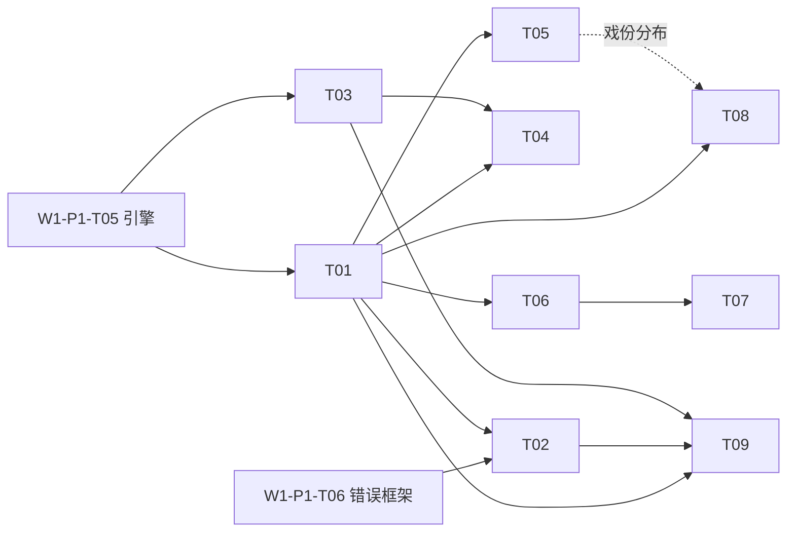

# Wave-01 就绪任务队列（Ready Tasks）

> **追加约定（append-only）**：本文件按计划槽分区维护。每个槽的内容包裹在
> `<!-- BEGIN:Px -->` / `<!-- END:Px -->` 标记之间；各槽**只在文件末尾追加自己的分区**，
> 不修改、不覆盖其他分区的有效内容。对已有分区的勘误由原槽负责人以追加「修订记录」小节完成。
> 任务 ID 格式 `W{波次}-{槽位}-T{序号}`，全库唯一，被引用后不得复用或改义。
>
> 说明：本文件在分支 `cursor/w1-p4-major-experience-features-5fba` 上基于 `main @ deda75a`（无此文件）创建，
> 仅含 P4 分区。P1、P2 分区已存在于各自分支（`cursor/w1-p1-usability-architecture-5d0e`、
> `cursor/w1-p2-interaction-reliability-a3c2`），合并时按分区标记拼接即可，无内容冲突。

---

<!-- BEGIN:P4 -->
## P4 重大工具体验功能（Major Experience Features）

- 来源方案：[`docs/wave-01/P4-major-experience-features.md`](./P4-major-experience-features.md)（含每项功能的问题/方案/影响面/工作量/验收/贴合点全文，本表为任务索引 + 明细）
- 产出分支：`cursor/w1-p4-major-experience-features-5fba`
- 公共前置：W1-P1-T02（ADR 定栈）→ W1-P1-T03（脚手架）→ W1-P1-T05（引擎与领域模型）、W1-P1-T06（错误框架）。下表「依赖」列只写直接前置。
- 工作量为技术规模（S/M/L），非日历时间。

### 总览

| 任务 ID | 名称 | 对应功能 | 优先级 | 工作量 | 依赖 | 状态 |
| --- | --- | --- | --- | --- | --- | --- |
| W1-P4-T01 | 内容索引层 | 公共地基 | P0 | M | W1-P1-T05 | ready（待 P1 引擎） |
| W1-P4-T02 | `sw check` 一致性规则引擎 | F1 | P0 | M | T01、W1-P1-T06 | blocked(T01) |
| W1-P4-T03 | 快照存储与 snapshot/restore | F2 | P0 | M | W1-P1-T05、W1-P1-T06 | ready（待 P1 引擎） |
| W1-P4-T04 | history/diff 场景级时间线 | F2 | P1 | M | T01、T03 | blocked(T03) |
| W1-P4-T05 | `sw character` 角色卡与出场索引 | F3 | P1 | M | T01、台词语法 ADR | blocked(T01) |
| W1-P4-T06 | 导出管线插件化 + Fountain | F5 | P1 | M–L | T01、W1-P1-T05、台词语法 ADR | blocked(T01) |
| W1-P4-T07 | PDF 版式导出与标题页 | F5 | P2 | L | T06 | blocked(T06) |
| W1-P4-T08 | `sw stats` 统计与节奏视图 | F4 | P2 | S–M | T01（`--by character` 还需 T05） | blocked(T01) |
| W1-P4-T09 | `sw move/renumber/remove` 结构事务 | F6 | P2 | M | T01、T02、T03 | blocked(T02,T03) |

### 任务明细

#### W1-P4-T01 · P0 · 内容索引层（场景/角色/大纲解析与项目索引）

- **目标**：把 `outline.md`、`scenes/*.md`、`characters/*.md` 解析为 core 领域模型的只读索引（含台词署名解析、mtime 缓存），作为 T02/T05/T06/T08/T09 的唯一取数面，杜绝各功能重复造解析器。
- **文件范围**：`src/app/index/`（索引构建与缓存）、`src/core/model/` 补充解析目标类型、单测与解析夹具。
- **验收标准**：① 夹具项目解析结果与人工标注一致（场景清单、署名、大纲条目）；② mtime 缓存命中时不重读未变更文件（以 IO 计数断言）；③ 解析器对畸形文件不抛裸异常，产出结构化「不可解析」条目（供 T02 出规则告警）；④ core 层零 IO（依赖方向 lint 或架构测试）。
- **风险**：台词署名语法未定——本任务先支持模板既有语法，语法 ADR 定案后仅改解析规则常量。
- **依赖**：W1-P1-T05。

#### W1-P4-T02 · P0 · `sw check` 一致性规则引擎与初版规则集（F1）

- **目标**：规则引擎 + `SW-Cxxx` 规则注册表（与 SPEC-03 同库同 lint），初版 ≥8 条内容一致性规则，`--fix` 白名单 + dry-run 默认，退出码可进 CI。
- **文件范围**：`src/app/check/`、CLI 子命令、SPEC-03 注册表扩段与 `docs/errors/`（或 `docs/checks/`）生成、每规则正反例夹具。
- **验收标准**：主文档 F1 验收 ①–⑤ 全项（规则数、三段式输出、fix 语义、50 场 <1s、退出码测试）。
- **风险**：规则误报伤信任——初版规则以「结构可判定」为准入，语义类规则（如剧情连贯）一律不收。
- **依赖**：T01、W1-P1-T06。

#### W1-P4-T03 · P0 · 快照存储与 `sw snapshot/restore`（F2 前半）

- **目标**：`.sw/history/` 内容寻址快照存储适配器 + snapshot/restore 命令；恢复走原子事务且前置自动安全快照；附「状态 vs 存档」补充 ADR（建议 ADR-0002，定案「删 `.sw/` 主工作流行为不变」边界）。
- **文件范围**：`src/infra/history/`、`src/app/history/`、CLI 两个子命令、`.gitignore` 模板项、`docs/adr/0002-*.md`、单测（含 kill -9 原子性）。
- **验收标准**：主文档 F2 验收 ①③④⑥（往返一致、安全快照、原子性、删 `.sw/` 行为不变）；ADR 合入。
- **风险**：内容寻址实现易过度设计——初版只需哈希去重 + index.yaml，禁止引入打包/压缩/GC（登记为后续任务）。
- **依赖**：W1-P1-T05、W1-P1-T06。

#### W1-P4-T04 · P1 · `sw history/diff` 场景级时间线与对比（F2 后半）

- **目标**：项目级/单场级时间线查询；场景粒度 diff（台词/动作行级渲染，80 列可读）；`restore --scene` 单场恢复。
- **文件范围**：`src/app/history/` 扩展、CLI 两个子命令、diff 渲染器与结构性快照测试。
- **验收标准**：主文档 F2 验收 ②⑤（单场恢复后 doctor/check 全绿、diff 快照测试）。
- **风险**：diff 渲染打磨无底——验收只锁结构断言（分段、标签、列宽），不锁视觉细节。
- **依赖**：T01、T03。

#### W1-P4-T05 · P1 · `sw character` 角色卡与出场索引（F3）

- **目标**：角色卡 CRUD（add/list/show）、frontmatter schema（含别名表）、出场矩阵与台词行数统计、与 T02 的「未建卡署名」warn 联动。
- **文件范围**：`src/core/model/character.ts`、CLI 子命令组、`templates/*/characters/` 示例卡、索引层署名归并逻辑、单测。
- **验收标准**：主文档 F3 验收 ①–⑤ 全项。
- **风险**：别名归并的边界情形（全半角、大小写、昵称）——初版只做显式别名表归并，不做模糊匹配。
- **依赖**：T01；台词语法 ADR（与 W1-P1-T07 对齐，先开工者定案）。

#### W1-P4-T06 · P1 · 导出管线插件化 + Fountain 导出（F5 前半）

- **目标**：`Exporter` 插件接口与注册表；把 W1-P1-T05 的 Markdown 导出迁移为首个插件（行为不变）；交付 Fountain 完整语法插件；`settings.export.presets` 与 `--preset` 旗标。
- **文件范围**：`src/app/export/`、`src/infra/export/fountain/`、project.yaml schema 扩展、CLI 旗标、round-trip 测试。
- **验收标准**：主文档 F5 验收 ①④⑤⑥（Fountain round-trip、多格式并存与模板默认、错误走 SPEC-03、md 插件迁移不回退）。
- **风险**：与 T05 的台词语法耦合——Fountain 映射表以语法 ADR 为唯一输入，ADR 未定前先落插件接口与 md 迁移。
- **依赖**：T01、W1-P1-T05；台词语法 ADR。

#### W1-P4-T07 · P2 · PDF 版式导出与标题页（F5 后半）

- **目标**：标准 screenplay 版式 PDF 插件（US Letter/A4）+ 标题页生成；渲染库选型 spike + 补充 ADR。
- **文件范围**：`src/infra/export/pdf/`、版式量化断言测试（页边距/缩进列位）、`docs/adr/` 选型 ADR。
- **验收标准**：主文档 F5 验收 ②③（版式量化断言、标题页字段完整）。
- **风险**：PDF 库重依赖/平台差异——spike 先行，选型不通过则本任务降级为「Fountain → 外部工具链」文档方案并回报调度器。
- **依赖**：T06。

#### W1-P4-T08 · P2 · `sw stats` 统计与节奏视图（F4）

- **目标**：项目/单场统计（字数、预计时长、每场长度条形图）、`--by character` 戏份分布；折算参数由模板声明。
- **文件范围**：`src/app/stats/`（计算核心纯函数）、CLI 子命令、模板 schema 折算参数、单测。
- **验收标准**：主文档 F4 验收 ①–⑤ 全项。
- **风险**：低。折算参数缺省时按格式给内置默认并在输出注明来源。
- **依赖**：T01；`--by character` 部分依赖 T05（可分两步交付）。

#### W1-P4-T09 · P2 · `sw move/renumber/remove` 结构重构事务（F6）

- **目标**：三处一致性事务（文件名/大纲结构化引用/progress）+ 操作前自动安全快照 + `.sw/trash/` 可恢复删除；自由文本引用不改、由 T02 出 warn。
- **文件范围**：`src/app/structure/`、CLI 子命令组、事务与中断测试、trash 恢复测试。
- **验收标准**：主文档 F6 验收 ①–⑤ 全项。
- **风险**：大纲同步策略——初版仅同步结构化引用（编号/锚点），把自然语言理解显式排除在范围外。
- **依赖**：T01、T02（回归手段）、T03（安全快照原语）。

### 任务依赖总览

**建议开工顺序**：T01 → T02 + T03 并行 → T04 / T05 / T06 → T07 / T08 / T09。
<!-- END:P4 -->
