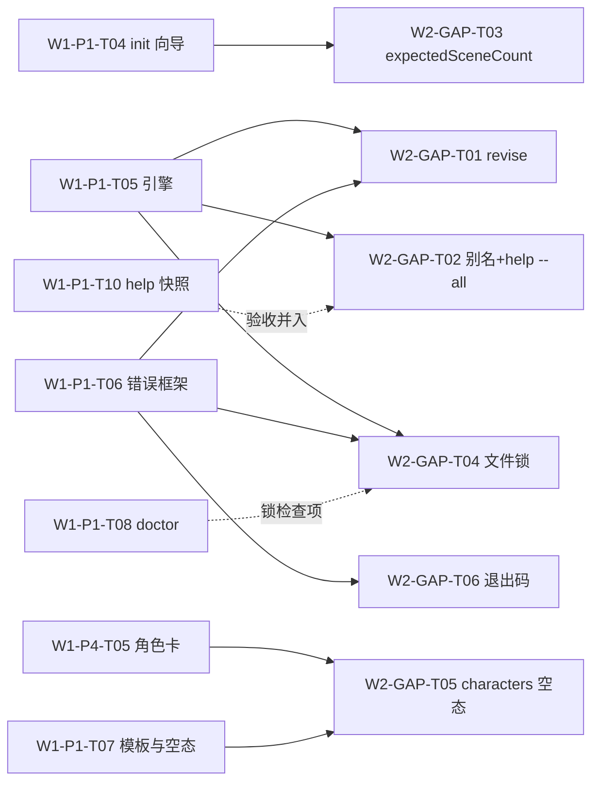
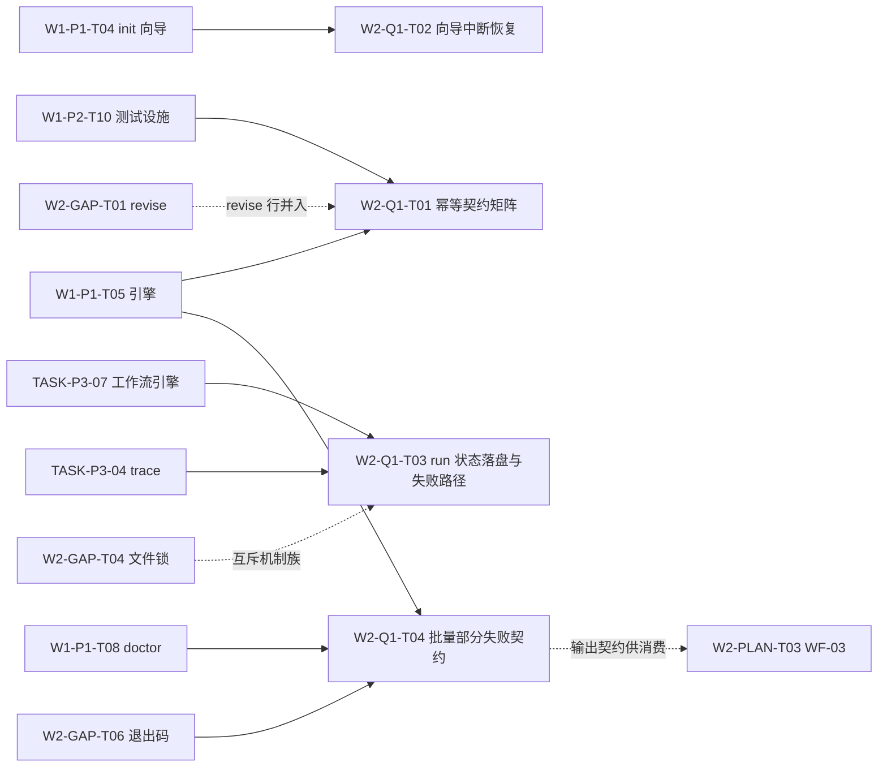

# Wave-02 就绪任务队列（Ready Tasks）

> **追加约定（append-only）**：沿用 wave-01 同名文件的分区纪律——每个槽的内容包裹在
> `<!-- BEGIN:xxx -->` / `<!-- END:xxx -->` 标记之间；各槽**只在文件末尾追加自己的分区**，
> 不修改、不覆盖其他分区的有效内容。对已有分区的勘误由原槽负责人以追加「修订记录」小节完成。
> 任务 ID 格式 `W{波次}-{槽位}-T{序号}`，全库唯一，被引用后不得复用或改义。
>
> 说明：本文件在分支 `cursor/w2-gap-adjudication-c82d` 上基于 `main @ deda75a`（无此文件）创建，
> 仅含 WAVE02-GAP 分区。wave-01 的 `docs/wave-01/ready-tasks.md` 各分区（P1、P2、P4）仍在各自分支，
> 本文件不携带其副本；两份文件是不同波次的队列，合并进 main 后并存，互相以任务 ID 引用。

---

<!-- BEGIN:WAVE02-GAP -->
## WAVE02-GAP GAP 裁决补登任务（GAP Adjudication Follow-ups）

- 来源方案：[`docs/wave-02/P-gap-adjudication.md`](./P-gap-adjudication.md)（下称「裁决文档」，含 SPEC-04 全要点、文件锁机制要点、退出码约定表与勘误登记）
- 产出分支：`cursor/w2-gap-adjudication-c82d`
- 公共前置：全部任务前置于 wave-01 实现任务（P1 分区 T03/T04/T05/T06/T08、P4 分区 T05），依赖列只写直接前置
- 状态图例：`ready`＝直接前置就绪即可开工；`blocked`＝等待前置任务

### 总览

| 任务 ID | 名称 | 对应 GAP | 优先级 | 工作量 | 依赖 | 状态 |
| --- | --- | --- | --- | --- | --- | --- |
| W2-GAP-T01 | 实现 SPEC-04 `sw revise` 修订步命令 | GAP-01 | P0 | M | W1-P1-T05、W1-P1-T06 | ready（待 P1 引擎/错误框架） |
| W2-GAP-T02 | 短别名表与 `sw help --all` 命令全集 | GAP-02 | P1 | S | W1-P1-T05；验收并入 W1-P1-T10 | ready（待 P1 引擎） |
| W2-GAP-T03 | `project.yaml` 可选字段 `expectedSceneCount` | GAP-03 | P1 | S | W1-P1-T04 | ready（待 init 向导） |
| W2-GAP-T04 | CLI 并发写文件锁与 `SW-E012` | GAP-04 | P1 | M | W1-P1-T05、W1-P1-T06；联动 W1-P1-T08 | ready（待 P1 引擎/错误框架） |
| W2-GAP-T05 | `characters/` 空态覆盖与基准清单回写 | GAP-05 | P2 | S | W1-P4-T05、W1-P1-T07 | blocked(W1-P4-T05) |
| W2-GAP-T06 | 全命令退出码约定落地（SPEC-03-EXT） | GAP-06 | P1 | S | W1-P1-T06 | ready（待错误框架） |

### 任务明细

#### W2-GAP-T01 · P0 · 实现 SPEC-04 `sw revise` 修订步命令（GAP-01）

- **目标**：按裁决文档 §3.1 SPEC-04 实现 `sw revise [scene-id] [--done] [--list]`：修订清单与建议下一场、打开场景修订、`--done` 幂等记入 `progress.scenes_revised`、status 联动（`已修订 x/y 场`、revise→export 推进）、对 P4 check/stats 的渐进增强引荐（不硬依赖）。
- **文件范围**：`src/cli/commands/revise.ts`、`src/app/workflow/` 修订步接线、`src/core/model/` progress 类型补 `scenes_revised`、对应单测与五步全链 e2e 扩展。
- **验收标准**：SPEC-04「验收要点」①–⑤ 全项（五步 e2e、`--done` 幂等字节不变、kill -9 状态一致、无硬依赖断言、help 示例进快照）。
- **风险**：与 W1-P1-T05 的 e2e/TTFS 基准耦合——revise 为可跳过步，TTFS 主路径（MP-01）不因本任务加长，须有「跳过 revise 直接 export 合法」的回归断言。
- **依赖**：W1-P1-T05、W1-P1-T06。

#### W2-GAP-T02 · P1 · 短别名表与 `sw help --all` 命令全集（GAP-02）

- **目标**：按裁决文档 §3.2 落地集中别名表（`sw d`/`sw x`/`sw r`）与 `sw help --all`（全集从命令注册表生成，禁止手工清单）；默认 help 保持只展示五步主命令 + status（渐进披露不回退）。
- **文件范围**：`src/cli/aliases.ts`（集中声明）、help 渲染扩展、lint 规则（散落注册别名报错）、W1-P1-T10 快照结构扩展（别名可见、`--all` 覆盖全部已注册命令断言）。
- **验收标准**：裁决文档 §3.2「验收要点」①–③（快照断言、默认 help 不含非主命令、别名与主命令逐字节等价）。
- **风险**：低。快照易碎问题沿用 W1-P1-T10 的既有缓解（只锁结构断言不锁全文）。
- **依赖**：W1-P1-T05；验收并入 W1-P1-T10。
- **状态（2026-08-28，W4 实现槽 `cursor/w4-help-registry-impl`）**：**已完成**。开工依据按勘误改指 SPEC-07 全文（别名全集扩为六只 i/o/d/r/x/s，GAP-02 扩展路径 + 勘误 §7-1/2）；依赖经勘误追加 W4-HELP-T01（已先行交付）。集中别名表落点为 `src/cli/registry.ts`（alias 字段 + 挂载循环唯一注入点，文件范围 `src/cli/aliases.ts` 按 SPEC-07 §4.1 归并入注册表）。SPEC-07 §5 验收 ①–⑨ 核销表见 `docs/wave-04/work-help-registry.md` §2；使能提交含本状态行。`docs/user/commands.md` 同步更新责任（SPEC-07 §6.2）因该文件未并入实现基分支而转 W4-HELP-T02 收口余项（work-help-registry.md §5）。

#### W2-GAP-T03 · P1 · `project.yaml` 可选字段 `expectedSceneCount`（GAP-03）

- **目标**：按裁决文档 §3.3 把向导第 ③ 问答案写入顶层可选字段 `expectedSceneCount`（正整数；`--yes` 亦写入默认 5）；`sw status` 完成度分母消费该字段，缺省时分母退化为 `scenes_done` 长度。字段名按裁决原文采用，不得「顺手统一」命名风格。
- **文件范围**：`src/infra/store/projectFile.ts` schema 类型、`src/app/workflow/init.ts` 写入、`src/app/workflow/engine.ts` status 分母逻辑、单测（有/无字段两分支）。
- **验收标准**：裁决文档 §3.3「验收要点」①–③（两模式写入正确、可选性兼容、分母双分支测试）。
- **风险**：低。与 W1-P1-T04 天然同文件范围，建议同槽合并交付以免两次动向导。
- **依赖**：W1-P1-T04。

#### W2-GAP-T04 · P1 · CLI 并发写文件锁与 `SW-E012`（GAP-04）

- **目标**：按裁决文档 §3.4 实现项目级建议性文件锁 `.sw/lock`（pid/hostname/acquired_at）：写命令启动获取、退出释放；只读命令不加锁；占用报 `SW-E012`（三段式 + doctor 修复指引）；stale 锁（pid 不存活）自动接管并告警；`sw doctor` 增加锁健康检查项。
- **文件范围**：`src/infra/store/lock.ts`、写命令接线、`SW-E012` 注册表登记与 `docs/errors/` 生成、`src/app/diagnostics/` 锁检查项、并发集成测试与 kill -9 stale 测试。
- **验收标准**：裁决文档 §3.4「验收要点」①–④（并发互斥、stale 接管、只读不受阻、doctor 红项）。
- **风险**：跨平台锁语义差异（Windows 文件占用）——采用「独占创建锁文件」而非 flock 系统调用，以可移植性优先；ADR-0002 兼容说明由 W1-P4-T03 承接（勘误表 #7）。
- **依赖**：W1-P1-T05、W1-P1-T06；联动 W1-P1-T08。

#### W2-GAP-T05 · P2 · `characters/` 空态覆盖与基准清单回写（GAP-05）

- **目标**：按裁决文档 §3.5 完成两件小事：① 交叉核验 W1-P4-T05 验收 ⑤ 的空态实现满足三要素并回写 ES-03 责任任务字段（勘误表 #5）；② F3 落地前的过渡期保证 `sw status`/`sw doctor` 对空 `characters/` 零误报、过渡文案不引用未实现命令（文案随 W1-P1-T07 空态清单评审定稿）。**不重复 F3 任何功能规格。**
- **文件范围**：空态位点接线核验、doctor/status 回归测试、W1-B ES 表勘误回写（合并后）。
- **验收标准**：裁决文档 §3.5「验收要点」①–②。
- **风险**：低。范围已收敛到「核验 + 不误报」，功能面全部在 W1-P4-T05。
- **依赖**：W1-P4-T05、W1-P1-T07。

#### W2-GAP-T06 · P1 · 全命令退出码约定落地（GAP-06 / SPEC-03-EXT）

- **目标**：按裁决文档 §3.6 SPEC-03-EXT 落地三档退出码（0 成功 / 1 运行期错误 / 2 用法错误）：接口层顶层 catch 统一设定，业务代码禁碰 `process.exit`（lint 拦截）；doctor/check 既有语义零变更。
- **文件范围**：`src/cli/` 顶层 catch 与退出码映射、lint 规则、每错误码触达用例的退出码断言、用法错误用例、CI 接线。
- **验收标准**：裁决文档 §3.6「验收要点」①–④（错误码断言、用法错误断言、原验收不回退、lint 拦截）。
- **风险**：低。约定本身已裁决，任务纯落地；新增退出码细分须先勘误 SPEC-03-EXT 表，禁止实现先行。
- **依赖**：W1-P1-T06。

> 状态：完成 —— W2 实现槽（错误框架+退出码） / 2026-08-27 / `cursor/w2-error-framework-exit-codes-f4d4`（验收对照见 `docs/wave-02/work-error-framework.md` §4；验收 ③ doctor/check 尚未实现、无可回退对象，其退出码语义已由三档表回归锁与顶层 catch 唯一出口预先保证）

### 任务依赖总览

**建议开工顺序**：T06（错误框架就绪即做，约定越早生效越省返工）→ T01 + T04（引擎期并行）→ T02 + T03（向导/help 期）→ T05（等 P4 角色卡）。
<!-- END:WAVE02-GAP -->

---

<!-- BEGIN:WAVE02-Q1 -->
## WAVE02-Q1 分区：Q1 裁定新立任务（P2 任务的 CLI 适配，登记于 2026-08-27，第 2 波 Q1 裁定槽）

- **来源方案**：[`docs/wave-02/Q1-p2-cli-adaptation.md`](./Q1-p2-cli-adaptation.md)（下称「Q1 裁定文档」，含调度器裁定原文、T02–T09 全量对照表 §3、延后清单 §4、勘误登记 §6、梯队插入建议 §7）。
- **登记范围**：仅登记裁定新立的 4 项 CLI 任务。原 W1-P2-T02…T09 定义**原样有效**（Web 形态回接用，见 Q1 裁定文档 §4 延后纪律）；由既有任务承接的部分（W1-P2-T03/T05 → SPEC-02、W2-GAP-T04、W1-P4-T03）不在此重复立项。
- **对账口径**：完成 W2-Q1-Txx **不视为**完成对应的原 W1-P2-Txx；W5 核验以本分区验收标准为准。
- **凭据解耦**：本分区 4 项任务全部无模型凭据可完成（BLK-W1-02 不阻塞）；W2-Q1-T03 以录制/回放 fixture 驱动并在验收中显式断言。
- **任务 ID 格式**：`W2-Q1-T{序号}`，全库唯一，被引用后不得复用或改义。

### 总览

| 任务 ID | 名称 | 源 P2 任务 | 优先级 | 工作量 | 依赖 | 状态 |
| --- | --- | --- | --- | --- | --- | --- |
| W2-Q1-T01 | 跨命令幂等契约测试矩阵 | W1-P2-T02 | P1 | S | W1-P1-T05、W1-P2-T10 | blocked(W1-P1-T05) |
| W2-Q1-T02 | `sw init` 向导中断恢复（本地会话） | W1-P2-T04 | P2 | M | W1-P1-T04 | blocked(W1-P1-T04) |
| W2-Q1-T03 | Agent run 状态落盘与失败路径（CLI 本地） | W1-P2-T07 | P1 | M | TASK-P3-01/04/07、W2-GAP-T04 | blocked(TASK-P3-07) |
| W2-Q1-T04 | 批量操作部分失败输出契约与残留清扫 | W1-P2-T08 | P1 | M | W1-P1-T05/T06/T08、W2-GAP-T06 | blocked(W1-P1-T05) |

### 任务明细

#### W2-Q1-T01 · P1 · 跨命令幂等契约测试矩阵（源 W1-P2-T02）

- **目标**：把「命令幂等」（P2 D5–D7 的 CLI 形态，W1-B EP-04 语义）从各任务分散验收升级为**注册表驱动的契约矩阵**：每个已注册写命令在命令注册表声明幂等策略元数据（幂等重跑 / 须 `--force` 显式覆盖 / 追加式），矩阵测试按声明自动生成用例骨架并断言重复执行后项目文件**字节不变**（或声明的补缺语义）；未声明策略的写命令使 CI 失败。矩阵从注册表生成、禁止手工清单（对齐 GAP-02 既有纪律）。不重做既有单任务的幂等验收（W1-P1-T04 重复 init、W2-GAP-T01 `revise --done` 等原样保留，矩阵引用之）。
- **建议文件**：`src/cli/` 命令注册表幂等策略元数据字段、`tests/idempotency/` 契约矩阵、CI 接线。
- **验收（二值）**：① 覆盖率断言：注册表中全部写命令均有幂等策略声明且各有 ≥1 矩阵用例，新增未声明命令时 CI 失败（附反例演示）；② init（重复 / `--force`）、draft（同 id 重复）、`revise --done`（重复）、export（重复）的字节级断言全部通过；③ 既有任务幂等验收零删改（diff 证明只增不改）。
- **风险**：低。测试骨架复用 W1-P2-T10 设施，避免重复搭建。
- **依赖**：W1-P1-T05、W1-P2-T10；W2-GAP-T01 交付后 revise 行并入矩阵（不阻塞矩阵框架先行）。

#### W2-Q1-T02 · P2 · `sw init` 向导中断恢复（本地会话）（源 W1-P2-T04）

- **目标**：P2 D20–D22 的 CLI 等价物：交互式 `sw init` 每答一问即把会话（已答答案 + 进度）**原子写入用户级缓存路径**（键含目标目录绝对路径哈希；**不得写入目标项目目录**，保持 EP-02「中断无半成品项目」与 EP-01「目录非空」判定不回退）；同目录重跑 `sw init` 检测到未完成会话 → 一行提示「继续上次创建（已答 n/4 问）/ 重新开始」；恢复后已答问题不重问（D22 精神）；完成或显式放弃即删除会话文件。会话文件为**瞬态非状态源**（对齐 ADR-0002 边界，与 `.sw/lock` 同族：删除后行为不变，仅丢恢复便利）。`--yes` 与全旗标零交互模式不建会话。D21（本地/远端双写、跨设备恢复）不做；多步 AI 向导（WF-01 人审节点）的挂起续跑由 TASK-P3-07 承接，本任务不涉。同目录并发两个向导为罕见路径，不新增机制，后完成者由 EP-01/SW-E010 既有语义兜底。
- **建议文件**：`src/app/workflow/` init 会话读写、`src/infra/store/` 用户缓存路径工具、向导恢复提示、e2e 用例。
- **验收（二值）**：① e2e：第 3 问处终止进程 → 目标目录无任何项目文件 → 重跑提示恢复 → 接受后前 2 问不再询问 → 最终 `project.yaml` 与一次性完成语义等价；② 拒绝恢复走全新向导且旧会话文件被清除；③ `--yes` 模式全程不产生会话文件；④ 正常首跑（无未完成会话）交互数与提示不变——EP-01/EP-02 回归断言 + TTFS 基准（W1-P1-T10）不回退。
- **风险**：恢复提示与 SPEC-01「≤ 4 问」极简体验的平衡——提示仅在存在未完成会话时出现一行，首跑路径零变化。
- **依赖**：W1-P1-T04。

#### W2-Q1-T03 · P1 · Agent run 状态落盘与失败路径（CLI 本地）（源 W1-P2-T07）

- **目标**：P2 D35–D38 的 CLI 本地形态。实现取向 = **在 TASK-P3-04 trace 与 TASK-P3-07 工作流引擎之上扩展失败路径语义，禁止第二套状态机**：① run 状态持久化于 `runs/`（status、当前步、各步产物引用），进程退出/重启后可查可续（与页面/进程生命周期解耦的 D35 精神）；status 枚举以 D35 为基准覆盖 {running, paused, step_failed, succeeded, failed, cancelled}，queued/awaiting_tool 在单机同步形态可并入 running，但映射须登记进实现文档，不得静默丢语义；② step_failed 支持「从失败步重试」，前序已成功步骤产物复用、不重执行（D37）；③ run 触发幂等：同项目同类型 run 在途时重复触发返回在途 run 标识、不新建（D38），互斥机制与 `.sw/lock` 同族（对齐 GAP-04，不发明第三种锁）；④ 工具输出畸形/schema 校验失败的存证沿用 TASK-P3-03（F1/F2 策略表）与 P3-04 trace（D36 已被承接），本任务仅断言存证在 run 状态中可见可查。D39（SSE `Last-Event-ID`）延后；不引入推送协议，本地进展呈现直接读 trace。
- **建议文件**：`src/agent/orchestrator/`（状态机扩展）、`runs/` run 状态文件 schema、run 级互斥、故障注入测试（回放 fixture）。
- **验收（二值）**：① 注入第 N 步工具失败 → run 进入 step_failed → 从失败步重试成功，且前序步骤工具调用计数不变（断言不重复执行）；② run 进行中 kill -9 → 重启后 run 状态与已产出步骤完整可查、可从断点继续；③ 同参数并发触发 2 次同类型 run → 仅新建 1 个，第二次返回在途 run 标识；④ 全部用例以录制/回放 fixture 驱动，无模型凭据环境 CI 全绿（BLK-W1-02 非阻塞断言）。
- **风险**：与 TASK-P3-07 的边界敏感（引擎归 P3 承接者）——本任务是其上的可靠性扩展，两任务不同槽承接时须同分支或紧前紧后交付，避免状态机双改冲突。建议同槽交付。
- **依赖**：TASK-P3-01（录制/回放模式即可）、TASK-P3-04、TASK-P3-07、W2-GAP-T04（互斥机制族）。

#### W2-Q1-T04 · P1 · 批量操作部分失败输出契约与残留清扫（源 W1-P2-T08）

- **目标**：P2 D17/D19 的 CLI 形态：定义**批量命令统一输出契约**——逐项结果（条目 id、成败、失败原因码），末行汇总（成功 x / 失败 y）+ 可复制的「仅重试失败项」命令（幂等语义使重试安全，呼应 W2-Q1-T01）；**部分成功为一等输出形态**，禁止把部分成功笼统报成失败；检查类批量另有「未检查」态（对齐 SPEC-P3-01 反假阴性纪律：未完成检查 ≠ 无问题）；退出码遵循 SPEC-03-EXT（W2-GAP-T06）：存在失败项 = 1、全部成功 = 0，**不新增退出码**（确需细分先勘误 SPEC-03-EXT 表）。D18 的 CLI 对应物：多文件写序列**逐文件原子写、失败即停、已完成项保留**（与 D17 逐项结果一致，不回滚成功项）；`sw doctor` 新增「中断残留」检查项（temp 文件残留 / stale 锁，红项 + 修复命令，联动 W1-P1-T08 可注册检查项与 W2-GAP-T04）。HTTP 207 与服务端 Saga/Outbox 延后。首批消费者：WF-03 全本扫描（W2-PLAN-T03）与后续批量 draft/export。
- **建议文件**：`src/app/` 批量执行器与输出契约类型、`src/cli/` 呈现层、doctor 检查项、契约测试。
- **验收（二值）**：① 契约测试：10 项批量注入 3 项失败 → 逐项输出准确、退出码 = 1、末行重试命令仅含失败的 3 项；② 按重试命令执行后全部成功 → 退出码 = 0；③ 多文件写第 2 项注入崩溃 → 已完成项完整保留，doctor 出红项 + 修复命令；④ 全成功路径输出不含任何部分失败噪音（结构快照断言，沿用「只锁结构不锁全文」缓解）。
- **风险**：WF-03（W2-PLAN-T03，梯队 E7）消费本契约，本任务须先于其交付（建议 E5，见 Q1 裁定文档 §7）。
- **依赖**：W1-P1-T05、W1-P1-T06、W1-P1-T08、W2-GAP-T06。

### 任务依赖总览

### 领取与状态约定

沿用既有分区约定：领取任务的执行槽位在对应任务明细末尾追加一行 `> 状态：<领取|完成> —— <槽位> / <日期> / <分支或commit>`；完成判定以验收标准逐条核对为准，证据不合格视为未完成。W2-Q1-T03 领取时须在状态行注明「扩展 TASK-P3-04/07，无第二套状态机」；W2-Q1-T04 领取时须注明「退出码按 SPEC-03-EXT，无新码」。
<!-- END:WAVE02-Q1 -->
