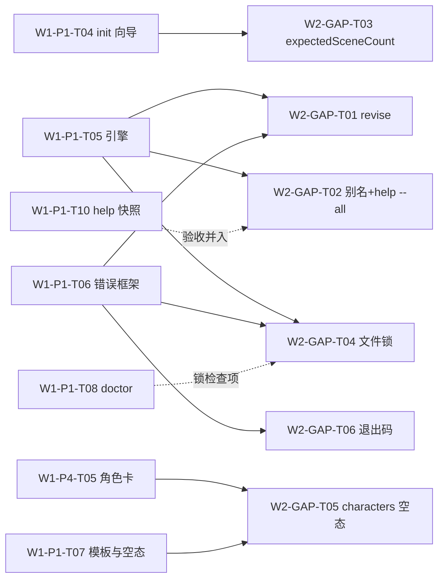

# Wave-02 就绪任务队列（Ready Tasks）

> **追加约定（append-only）**：沿用 wave-01 同名文件的分区纪律——每个槽的内容包裹在
> `<!-- BEGIN:xxx -->` / `<!-- END:xxx -->` 标记之间；各槽**只在文件末尾追加自己的分区**，
> 不修改、不覆盖其他分区的有效内容。对已有分区的勘误由原槽负责人以追加「修订记录」小节完成。
> 任务 ID 格式 `W{波次}-{槽位}-T{序号}`，全库唯一，被引用后不得复用或改义。
>
> 说明：本文件在分支 `cursor/w2-gap-adjudication-c82d` 上基于 `main @ deda75a`（无此文件）创建，
> 仅含 WAVE02-GAP 分区。wave-01 的 `docs/wave-01/ready-tasks.md` 各分区（P1、P2、P4）仍在各自分支，
> 本文件不携带其副本；两份文件是不同波次的队列，合并进 main 后并存，互相以任务 ID 引用。

---

<!-- BEGIN:WAVE02-GAP -->
## WAVE02-GAP GAP 裁决补登任务（GAP Adjudication Follow-ups）

- 来源方案：[`docs/wave-02/P-gap-adjudication.md`](./P-gap-adjudication.md)（下称「裁决文档」，含 SPEC-04 全要点、文件锁机制要点、退出码约定表与勘误登记）
- 产出分支：`cursor/w2-gap-adjudication-c82d`
- 公共前置：全部任务前置于 wave-01 实现任务（P1 分区 T03/T04/T05/T06/T08、P4 分区 T05），依赖列只写直接前置
- 状态图例：`ready`＝直接前置就绪即可开工；`blocked`＝等待前置任务

### 总览

| 任务 ID | 名称 | 对应 GAP | 优先级 | 工作量 | 依赖 | 状态 |
| --- | --- | --- | --- | --- | --- | --- |
| W2-GAP-T01 | 实现 SPEC-04 `sw revise` 修订步命令 | GAP-01 | P0 | M | W1-P1-T05、W1-P1-T06 | ready（待 P1 引擎/错误框架） |
| W2-GAP-T02 | 短别名表与 `sw help --all` 命令全集 | GAP-02 | P1 | S | W1-P1-T05；验收并入 W1-P1-T10 | ready（待 P1 引擎） |
| W2-GAP-T03 | `project.yaml` 可选字段 `expectedSceneCount` | GAP-03 | P1 | S | W1-P1-T04 | ready（待 init 向导） |
| W2-GAP-T04 | CLI 并发写文件锁与 `SW-E012` | GAP-04 | P1 | M | W1-P1-T05、W1-P1-T06；联动 W1-P1-T08 | ready（待 P1 引擎/错误框架） |
| W2-GAP-T05 | `characters/` 空态覆盖与基准清单回写 | GAP-05 | P2 | S | W1-P4-T05、W1-P1-T07 | blocked(W1-P4-T05) |
| W2-GAP-T06 | 全命令退出码约定落地（SPEC-03-EXT） | GAP-06 | P1 | S | W1-P1-T06 | ready（待错误框架） |

### 任务明细

#### W2-GAP-T01 · P0 · 实现 SPEC-04 `sw revise` 修订步命令（GAP-01）

- **目标**：按裁决文档 §3.1 SPEC-04 实现 `sw revise [scene-id] [--done] [--list]`：修订清单与建议下一场、打开场景修订、`--done` 幂等记入 `progress.scenes_revised`、status 联动（`已修订 x/y 场`、revise→export 推进）、对 P4 check/stats 的渐进增强引荐（不硬依赖）。
- **文件范围**：`src/cli/commands/revise.ts`、`src/app/workflow/` 修订步接线、`src/core/model/` progress 类型补 `scenes_revised`、对应单测与五步全链 e2e 扩展。
- **验收标准**：SPEC-04「验收要点」①–⑤ 全项（五步 e2e、`--done` 幂等字节不变、kill -9 状态一致、无硬依赖断言、help 示例进快照）。
- **风险**：与 W1-P1-T05 的 e2e/TTFS 基准耦合——revise 为可跳过步，TTFS 主路径（MP-01）不因本任务加长，须有「跳过 revise 直接 export 合法」的回归断言。
- **依赖**：W1-P1-T05、W1-P1-T06。

#### W2-GAP-T02 · P1 · 短别名表与 `sw help --all` 命令全集（GAP-02）

- **目标**：按裁决文档 §3.2 落地集中别名表（`sw d`/`sw x`/`sw r`）与 `sw help --all`（全集从命令注册表生成，禁止手工清单）；默认 help 保持只展示五步主命令 + status（渐进披露不回退）。
- **文件范围**：`src/cli/aliases.ts`（集中声明）、help 渲染扩展、lint 规则（散落注册别名报错）、W1-P1-T10 快照结构扩展（别名可见、`--all` 覆盖全部已注册命令断言）。
- **验收标准**：裁决文档 §3.2「验收要点」①–③（快照断言、默认 help 不含非主命令、别名与主命令逐字节等价）。
- **风险**：低。快照易碎问题沿用 W1-P1-T10 的既有缓解（只锁结构断言不锁全文）。
- **依赖**：W1-P1-T05；验收并入 W1-P1-T10。

#### W2-GAP-T03 · P1 · `project.yaml` 可选字段 `expectedSceneCount`（GAP-03）

- **目标**：按裁决文档 §3.3 把向导第 ③ 问答案写入顶层可选字段 `expectedSceneCount`（正整数；`--yes` 亦写入默认 5）；`sw status` 完成度分母消费该字段，缺省时分母退化为 `scenes_done` 长度。字段名按裁决原文采用，不得「顺手统一」命名风格。
- **文件范围**：`src/infra/store/projectFile.ts` schema 类型、`src/app/workflow/init.ts` 写入、`src/app/workflow/engine.ts` status 分母逻辑、单测（有/无字段两分支）。
- **验收标准**：裁决文档 §3.3「验收要点」①–③（两模式写入正确、可选性兼容、分母双分支测试）。
- **风险**：低。与 W1-P1-T04 天然同文件范围，建议同槽合并交付以免两次动向导。
- **依赖**：W1-P1-T04。

#### W2-GAP-T04 · P1 · CLI 并发写文件锁与 `SW-E012`（GAP-04）

- **目标**：按裁决文档 §3.4 实现项目级建议性文件锁 `.sw/lock`（pid/hostname/acquired_at）：写命令启动获取、退出释放；只读命令不加锁；占用报 `SW-E012`（三段式 + doctor 修复指引）；stale 锁（pid 不存活）自动接管并告警；`sw doctor` 增加锁健康检查项。
- **文件范围**：`src/infra/store/lock.ts`、写命令接线、`SW-E012` 注册表登记与 `docs/errors/` 生成、`src/app/diagnostics/` 锁检查项、并发集成测试与 kill -9 stale 测试。
- **验收标准**：裁决文档 §3.4「验收要点」①–④（并发互斥、stale 接管、只读不受阻、doctor 红项）。
- **风险**：跨平台锁语义差异（Windows 文件占用）——采用「独占创建锁文件」而非 flock 系统调用，以可移植性优先；ADR-0002 兼容说明由 W1-P4-T03 承接（勘误表 #7）。
- **依赖**：W1-P1-T05、W1-P1-T06；联动 W1-P1-T08。

#### W2-GAP-T05 · P2 · `characters/` 空态覆盖与基准清单回写（GAP-05）

- **目标**：按裁决文档 §3.5 完成两件小事：① 交叉核验 W1-P4-T05 验收 ⑤ 的空态实现满足三要素并回写 ES-03 责任任务字段（勘误表 #5）；② F3 落地前的过渡期保证 `sw status`/`sw doctor` 对空 `characters/` 零误报、过渡文案不引用未实现命令（文案随 W1-P1-T07 空态清单评审定稿）。**不重复 F3 任何功能规格。**
- **文件范围**：空态位点接线核验、doctor/status 回归测试、W1-B ES 表勘误回写（合并后）。
- **验收标准**：裁决文档 §3.5「验收要点」①–②。
- **风险**：低。范围已收敛到「核验 + 不误报」，功能面全部在 W1-P4-T05。
- **依赖**：W1-P4-T05、W1-P1-T07。

#### W2-GAP-T06 · P1 · 全命令退出码约定落地（GAP-06 / SPEC-03-EXT）

- **目标**：按裁决文档 §3.6 SPEC-03-EXT 落地三档退出码（0 成功 / 1 运行期错误 / 2 用法错误）：接口层顶层 catch 统一设定，业务代码禁碰 `process.exit`（lint 拦截）；doctor/check 既有语义零变更。
- **文件范围**：`src/cli/` 顶层 catch 与退出码映射、lint 规则、每错误码触达用例的退出码断言、用法错误用例、CI 接线。
- **验收标准**：裁决文档 §3.6「验收要点」①–④（错误码断言、用法错误断言、原验收不回退、lint 拦截）。
- **风险**：低。约定本身已裁决，任务纯落地；新增退出码细分须先勘误 SPEC-03-EXT 表，禁止实现先行。
- **依赖**：W1-P1-T06。

> 状态：完成 —— W2 实现槽（错误框架+退出码） / 2026-08-27 / `cursor/w2-error-framework-exit-codes-f4d4`（验收对照见 `docs/wave-02/work-error-framework.md` §4；验收 ③ doctor/check 尚未实现、无可回退对象，其退出码语义已由三档表回归锁与顶层 catch 唯一出口预先保证）

### 任务依赖总览

**建议开工顺序**：T06（错误框架就绪即做，约定越早生效越省返工）→ T01 + T04（引擎期并行）→ T02 + T03（向导/help 期）→ T05（等 P4 角色卡）。
<!-- END:WAVE02-GAP -->
